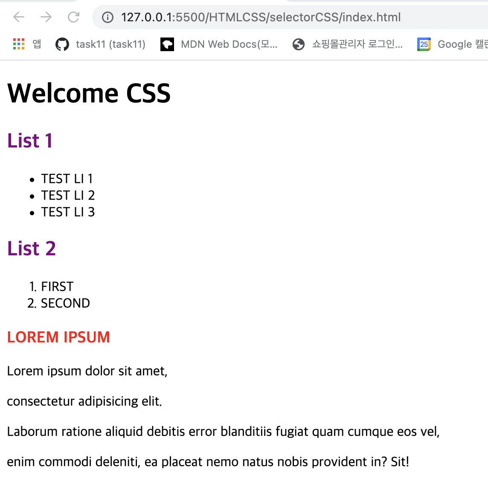
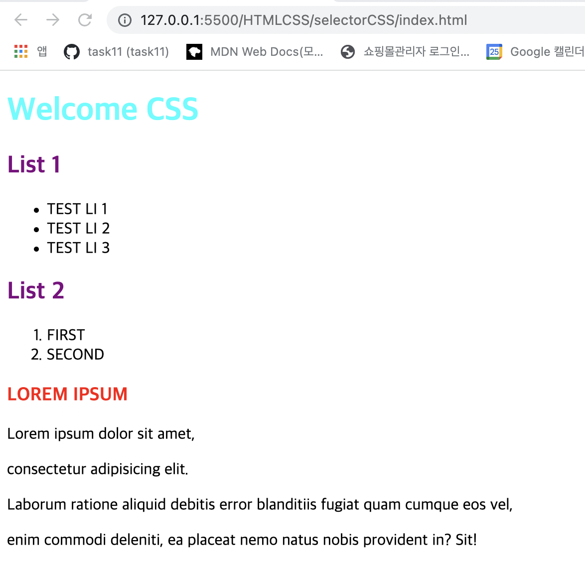
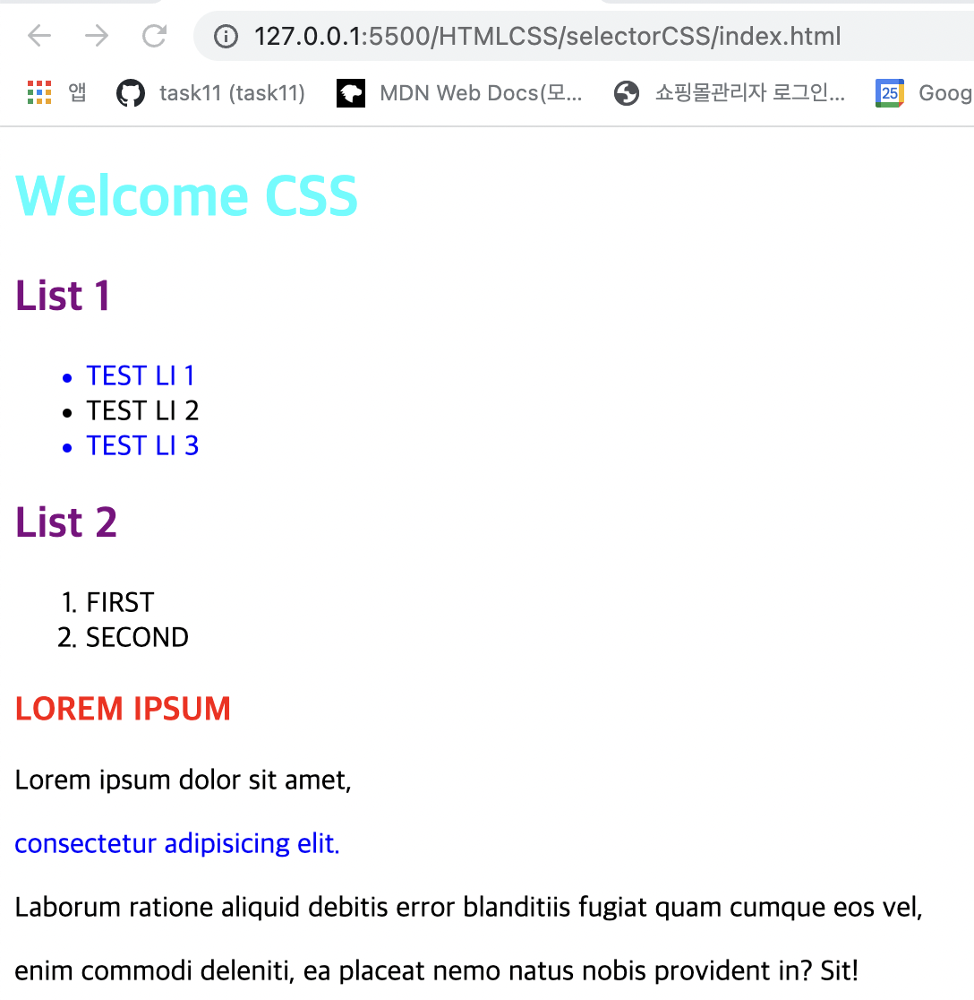
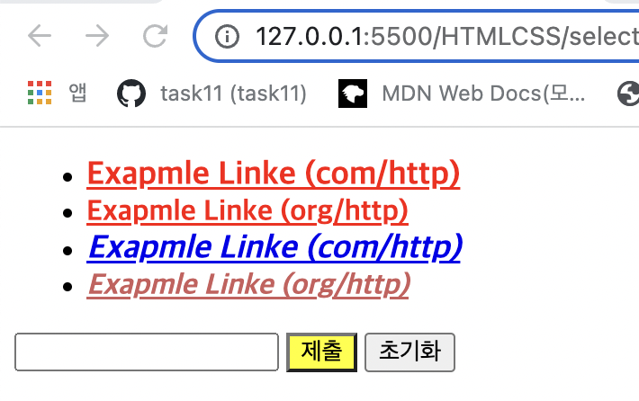
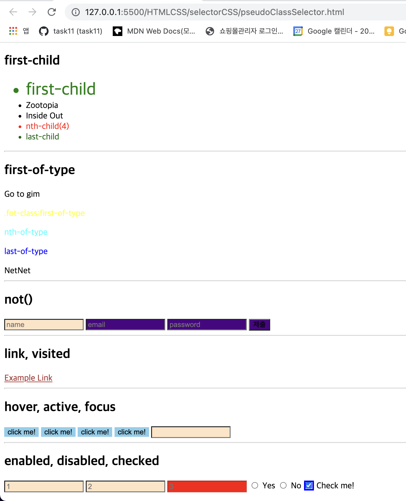
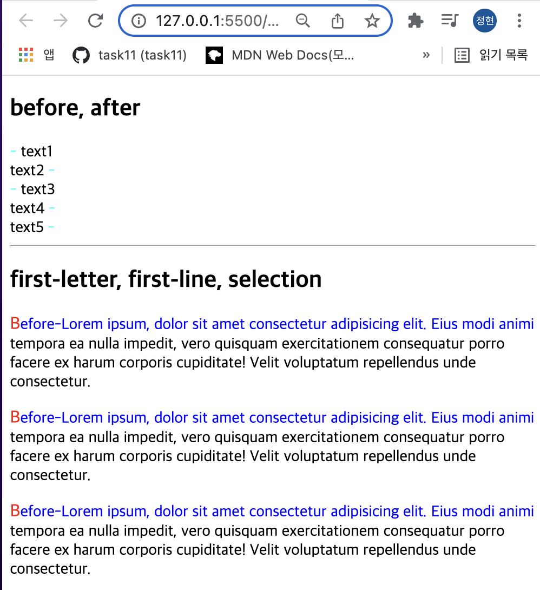

> 💡 CSS의 Cascading원칙과 Selector에 대해 알아보자.

# 개요 🛫

---

> 이번 포스트에서는 CSS의 기초인 Selector가 핵심이다.

CSS의 꾸미는 요소들을 학습하기 전에 Cascading 원칙과 CSS에 다양한 Selector들을 예제를 통해 알아보는 시간을 가질 것이다.

# 학습 내용 📖

---

## CSS Cascading

> CSS를 적용하기 전에 알아야하는 원칙들이다.

### 스타일 우선순위

- 동일한 스타일도 **선언된 위치**에 따라 우선순위가 결정된다.
  1.  사용자가 구성한 스타일(ex 다크 / 색약모드 / 커스텀 스타일 등) 2. 개발자가 선언한 스타일 3. 브라우저 기본 스타일
- 스타일 **적용 범위**에 따라 우선순위가 결정된다. (좁을 수록)
  1.  인라인 스타일 2. id 스타일 3. class 스타일 4. tag 스타일
- 소스 **코드의 위치**에 따라 우선순위가 결정된다.
  1.  코드의 순서가 뒤에 있으면 덮어 쓴다. (최종 스타일 적용은 맨 뒤 코드)

### 스타일 상속

- 부모 요소에 있는 스타일 속성들은 자식 요소로 전달된다.
  1.  자식 요소에서 재 정의 할 경우, 부모의 스타일을 덮어쓴다.
- 상속이 되지 않는 속성도 있다.
  ex)
  width/height
  margin
  padding
  border
  box-sizing
  display ....

상속되지 않는 경우(상속받지 않는 요소 또는 상속되지 않는 프로퍼티),
`inherit` 키워드를 사용하여 명시적으로 상속받게 할 수 있다.

## CSS Selector

> CSS Selector의 종류를 알아보고 예제를 통해 어떻게 적용되는지 확인해보겠다.

---

### Type/ID/Class Selector

**HTML :**

```HTML
<!DOCTYPE html>
<html lang="en">

<head>
  <meta charset="UTF-8">
  <meta http-equiv="X-UA-Compatible" content="IE=edge">
  <meta name="viewport" content="width=device-width, initial-scale=1.0">
  <link rel="stylesheet" href="main.css">
  <title>CSS Selector</title>
</head>

<body>
  <h1 id="welcome-title">Welcome CSS</h1>

  <h2>List 1</h2>
  <ul>
    <li class="color-blue">TEST LI 1</li>
    <li>TEST LI 2</li>
    <li class="color-blue">TEST LI 3</li>
  </ul>

  <h2>List 2</h2>
  <ol>
    <li>FIRST</li>
    <li>SECOND</li>
  </ol>

  <h3>LOREM IPSUM</h3>
  <p>Lorem ipsum dolor sit amet, </p>
  <p class="color-blue">consectetur adipisicing elit.</p>
  <p> Laborum ratione aliquid debitis error blanditiis fugiat quam cumque eos vel, </p>
  <p>enim commodi deleniti, ea placeat nemo natus nobis provident in? Sit!</p>
</body>

</html>
```

### Type Selector

> 특정 태그 전체에 적용되는 선택자로 사용에 주의가 필요하다.

1. 유지보수성이 떨어지므로 특정 내용을 변경할 때 사용을 지양한다.
2. 보통 CSS 최상단에 코드를 먼저 작성한다.

**CSS: **

```css
/* Type Selector */
h2 {
  color: purple;
}

h3 {
  color: red;
}
```

**Result:**



---

### ID Selector

> 태그에 입력한 id 값에만 적용된다.

1. 태그 하나에 하나의 id를 부여해야한다.
2. 중복으로 부여할 수 없다.

**CSS: **

```css
/* ID Selector */
#welcome-title {
  color: aqua;
}
```

**Result:**



---

### Class Selector

> 태그에 입력한 class 값들에 적용된다.

1. 태그 여러개에 class를 부여할 수 있다.
2. 가장 많이 사용되는 CSS 적용 방식이다.

**CSS: **

```css
/* Class Selector */
.color-blue {
  color: blue;
}
```

**Result:**



---

### Attribute Selector (속성 선택자)

> 태그 내부에 속성 값 (Attribute)가 있는 태그들만 스타일을 적용시킨다.

Attribute Selector 적용에는 다섯 가지 방식이 있다.

1. [attr] : 속성을 지정해서 통일
2. [attr=value] : 속성과 그 값까지 지정해서 통일
   - input 태그의 type을 구분해서 스타일을 통일 시킬 때 많이 사용된다.
3. [attr^=value] : value 값으로 시작되는 값을 가진 속성들에게 적용
4. [attr$=value] : value 값으로 끝나는 값을 가진 속성들에게 적용
5. [attr*=value] : value 값을 포함하는 속성들에게 적용

**HTML :**

```HTML
<!DOCTYPE html>
<html lang="en">

<head>
  <meta charset="UTF-8">
  <meta http-equiv="X-UA-Compatible" content="IE=edge">
  <meta name="viewport" content="width=device-width, initial-scale=1.0">
  <link rel="stylesheet" href="attributeSelector.css">
  <title>Attribute Selector</title>
</head>

<body>

  <ul>
    <li>
      <a href="http://example.com" target="_blank">
        Exapmle Linke (com/http)
      </a>
    </li>
    <li>
      <a href="http://example.org" target="_blank">
        Exapmle Linke (org/http)
      </a>
    </li>
    <li>
      <a href="https://example.com">
        Exapmle Linke (com/http)
      </a>
    </li>
    <li>
      <a href="https://example.org">
        Exapmle Linke (org/http)
      </a>
    </li>
  </ul>

  <input type="text">
  <input type="submit">
  <input type="reset">

</body>

</html>
```

**CSS: **

```css
/* Attribute Selector */

/* 1. [attr] */
a[target] {
  color: red;
}

/* 2. [attr=value] */
a[href="https://example.org"]
{
  color: indianred;
}

input[type="submit"] {
  background-color: yellow;
}

/* 3. [attr^=value] */
a[href^="https://"]
{
  font-style: italic;
}

/* 4. [attr$=value] */
a[href$=".com"] {
  font-size: large;
}

/* 5. [attr*=value] */
a[href*="example"] {
  font-weight: bold;
}
```

**Result:**



---

### Pseudo-class Selector (가상 클래스 선택자)

> selector로 가져온 요소에서 추가로 범위를 좁힐 수 있는 선택자이다.

1. selector:`first-child` : selector로 가져온 요소의 **부모 태그 기준으로** 첫 번째 요소에만 적용
   - 부모 태그 아래 첫 번째 요소가 selector에 부합하지 않으면 스타일 적용이 안된다.
2. selector:`last-child` : selector로 가져온 요소의 **부모 태그 기준으로** 마지막 요소에만 적용

3. selector:`nth-child(n)` : selector로 가져온 요소의 **부모 태그 기준으로** n 번째 요소에 적용
   - n 부분에 함수 입력 가능 ( ex 2n , even, odd )
4. selector:`first-of-type` : selector로 가져온 요소 중 첫 번째 태그의 요소에만 적용
   - selector로 가져온 것이 **여러 태그가** 같은 클래스인 경우 하나의 태그들은 전부 스타일이 적용된다.
5. selector:`last-of-type` : selector로 가져온 요소 중 마지막 태그의 요소에만 적용

6. selector:`nth-of-type(n)` : selector로 가져온 요소 중 n 번째 태그 요소에 적용

7. selector1:`not(selector2)` : selector1으로 가져온 요소들 중에 selector2로 가져온 요소를 제외하고 적용

8. a:`link` : 하이퍼 링크의 상태가 방문하기 이전일 때의 스타일을 적용

9. a:`visited` : 하이퍼 링크의 상태가 방문한 이후일 때의 스타일을 적용

10. selector:`hover` : selector로 가져온 요소에 마우스를 올리면 스타일이 적용

11. selector:`active` : selector로 가져온 요소(버튼 등)의 활성화 시 나타남.

    - 마우스를 사용하는 경우, "활성"이란 보통 마우스 버튼을 누르는 순간부터 떼는 시점까지를 의미

12. selector:`focus` : selector로 가져온 요소(버튼 등)의 양식의 입력 칸 등 포커스를 받은 요소
    - 보통 사용자가 요소를 클릭 또는 탭하거나, 키보드 Tab 키로 선택했을 때 발동

**HTML :**

```HTML
<!DOCTYPE html>
<html lang="en">

<head>
  <meta charset="UTF-8">
  <meta http-equiv="X-UA-Compatible" content="IE=edge">
  <meta name="viewport" content="width=device-width, initial-scale=1.0">
  <link rel="stylesheet" href="pseudoClassSelector.css">
  <title>Pseudo-class Selector</title>
</head>

<body>

  <h2>first-child</h2>
  <ul>
    <li class="movie">first-child</li>
    <li class="movie">Zootopia</li>
    <li class="movie">Inside Out</li>
    <li class="movie">nth-child(4)</li>
    <li class="movie">last-child</li>
  </ul>
  <hr />
  <h2>first-of-type</h2>
  <section>
    <div>Go to gim</div>
    <p class="fot-class">.fot-class:first-of-type</p>
    <p>nth-of-type</p>
    <p>last-of-type</p>
    <div>NetNet</div>
  </section>
  <hr />
  <h2>not()</h2>
  <input type="text" placeholder="name">
  <input type="email" placeholder="email">
  <input class="passwd" type="password" placeholder="password">
  <input type="submit">

  <hr />
  <h2>link, visited</h2>
  <a href="http://example.com">Example Link</a>

  <hr />
  <h2>hover, active, focus</h2>
  <input type="button" value="click me!">
  <input type="button" value="click me!">
  <input type="button" value="click me!">
  <input type="button" value="click me!">
  <input type="text">

  <hr />
  <h2>enabled, disabled, checked</h2>
  <input type="text" placeholder="1">
  <input type="text" placeholder="2">
  <input type="text" placeholder="3" disabled>

  <input type="radio" name="my-input" id="yes">
  <label for="yes">Yes</label>
  <input type="radio" name="my-input" id="no">
  <label for="no">No</label>

  <input type="checkbox" name="check-me" id="check-me">
  <label for="check-me">Check me!</label>

</body>

</html>
```

**CSS: **

```css
/* Pseudo-class Selector */

/* 1. first-child */
li:first-child {
  color: green;
}

.movie:first-child {
  font-size: 32px;
}

/* 2. last-child */
li:last-child {
  color: darkgreen;
}

/* 3. nth-child */
li:nth-child(4) {
  color: red;
}

/* 4. first-of-type */
.fot-class:first-of-type {
  color: yellow;
}

/* 5. last-of-type */
p:last-of-type {
  color: blue;
}

/* 6. nth-of-type */
p:nth-of-type(2n) {
  color: aqua;
}

/* 7. not() */
input:not([type="text"]) {
  background-color: indigo;
}

/* 8. link */
a:link {
  color: red;
}

/* 9. visited */
a:visited {
  color: brown;
}

/* 10. hover */
input[value="click me!"] {
  background-color: skyblue;
  border: none;
}

input[value="click me!"]:hover {
  background-color: teal;
  color: white;
}

/* 11. active */
input[value="click me!"]:active {
  background-color: yellow;
}

/* 12. focus */
input[type="text"]:focus {
  background-color: brown;
}

/* 13. enabled */
input[type="text"]:enabled {
  background-color: bisque;
}

/* 14. disabled */
input[type="text"]:disabled {
  background-color: red;
}

/* 15. checked */
input[type="radio"]:checked {
  outline: 3px solid red;
}

input[type="checkbox"]:checked {
  outline: 3px solid blue;
}
```

**Result:**



---

### Pseudo-attribute Selector (가상 요소 선택자)

> selector로 가져온 속성에서 추가로 범위를 좁힐 수 있는 선택자이다.

1. selector::`before` : 선택한 요소의 **앞**에 의사 요소를 하나 생성함.

   - 보통 content 속성과 함께 짝지어, 요소에 장식용 콘텐츠를 추가할 때 사용하며, menu사이에 구분자 등을 넣을 때 사용한다.(의미를 넣지는 않음)

2. selector::`after` : 선택한 요소의 **뒤**에 의사 요소를 하나 생성함.

   - 보통 content 속성과 함께 짝지어, 요소에 장식용 콘텐츠를 추가할 때 사용하며, menu사이에 구분자 등을 넣을 때 사용한다.(의미를 넣지는 않음)

3. selector::`first-letter` : 선택한 요소의 첫 번째 글자의 스타일을 변경해줌

   - `before`과 함께 사용하게 되면 before에서 지정해준 content 속성 값의 첫 번째 글자의 스타일이 변경됨.

4. selector::`first-line` : 선택한 요소의 첫 줄의 스타일을 변경해줌.
   - 화면크기에 따라 보이는 요소의 양과 상관없이 **첫 줄** 만 변경된다.
5. selector::`selection` : 선택한 요소의 드래그 스타일을 변경해줌.

**HTML :**

```HTML
<!DOCTYPE html>
<html lang="en">

<head>
  <meta charset="UTF-8">
  <meta http-equiv="X-UA-Compatible" content="IE=edge">
  <meta name="viewport" content="width=device-width, initial-scale=1.0">
  <link rel="stylesheet" href="pseudoElementSelector.css">
  <title>Pseudo-element Selector</title>
</head>

<body>
  <h2>before, after</h2>
  <div class="before-after focus"> text1 </div>
  <div class="before-after"> text2 </div>
  <div class="before-after focus"> text3 </div>
  <div class="before-after"> text4 </div>
  <div class="before-after"> text5 </div>
  <hr />
  <h2>first-letter, first-line, selection</h2>
  <p class="lorem">Lorem ipsum, dolor sit amet consectetur adipisicing elit. Eius modi animi tempora ea nulla impedit,
    vero quisquam
    exercitationem consequatur porro facere ex harum corporis cupiditate! Velit voluptatum repellendus unde consectetur.
  </p>
  <p class="lorem">Lorem ipsum, dolor sit amet consectetur adipisicing elit. Eius modi animi tempora ea nulla impedit,
    vero quisquam
    exercitationem consequatur porro facere ex harum corporis cupiditate! Velit voluptatum repellendus unde consectetur.
  </p>
  <p class="lorem">Lorem ipsum, dolor sit amet consectetur adipisicing elit. Eius modi animi tempora ea nulla impedit,
    vero quisquam
    exercitationem consequatur porro facere ex harum corporis cupiditate! Velit voluptatum repellendus unde consectetur.
  </p>


</body>

</html>
```

**CSS :**

```css
/* 1. before */
.focus::before {
  content: "-";
  color: aqua;
}

/* 2. after */
.before-after:not(.focus)::after {
  content: "-";
  color: aqua;
}

/* 3. first-letter */
.lorem::first-letter {
  font-size: large;
  color: red;
}

.lorem::before {
  content: "Before-";
}

/* 4. first-line */
.lorem::first-line {
  color: blue;
}

/* 5. selection */
.lorem::selection {
  background-color: aqua;
  color: wheat;
}
```

**Result :**



---

# Review 💡

> CSS를 적재적소에 효과적으로 사용하기 위해서는 다양한 Selector를 아는게 좋다.

다양한 Selector들의 사용방법을 알면 적재적소에 맞는 퍼블리싱이 가능해진다.
