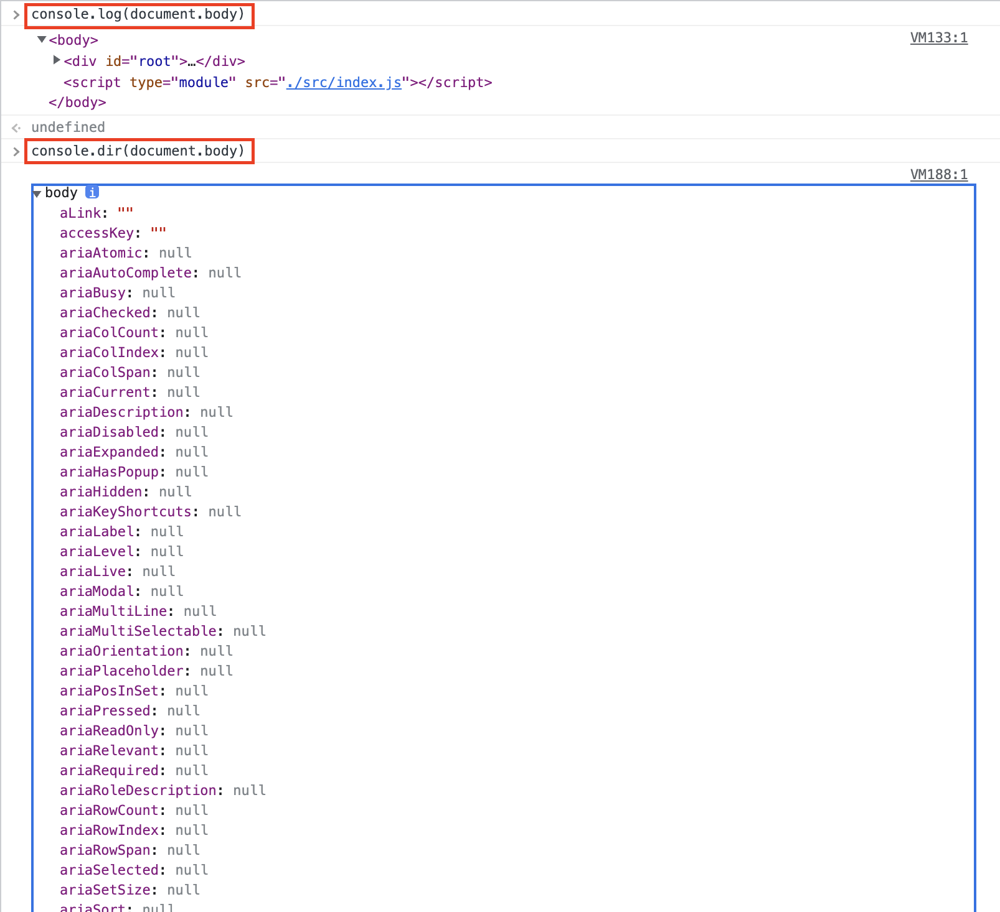
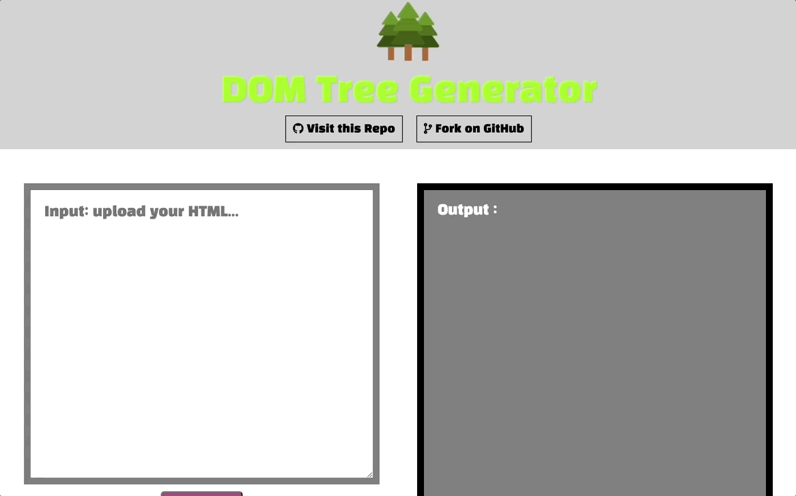

> 💡 이 포스팅은 DOM에 대해 공부하며 정리한 내용입니다. 혹여나 일부 올바르지 않은 정보가 있을 시에 지적해주시면 정정토록하겠습니다.

# 개요 🛫

> DOM에 대한 이해와 접근 방법에 대해 공부하고, 간단한 프로젝트를 제작합니다.

이번 포스팅에서는 프론트엔드 개발의 꽃🌻인 DOM에 대한 내용을 정리해보고자 한다.

DOM의 구조와 접근방법(메서드)에 대해 정리하고. DOM과 관련된 간단한 아이디어가 떠올라 기능을 제작해보고자한다.

---

# Document Object Model 📄


## DOM 이란?

> 문서 객체 모델(The Document Object Model, 이하 DOM) 은 HTML, XML 문서의 프로그래밍 interface 이다. DOM은 문서의 구조화된 표현(structured representation)을 제공하며 프로그래밍 언어가 DOM 구조에 접근할 수 있는 방법을 제공하여 그들이 문서 구조, 스타일, 내용 등을 변경할 수 있게 돕는다. DOM 은 nodes와 objects로 문서를 표현한다. `- mdn web docs`

위 정의에 나와있는 DOM 구조에 접근하고 내용을 변경하도록 돕는 `프로그래밍 언어`는 `javaScript`라고 할 수 있다.

간단하게 설명하기 위해 기본적인 HTML 문서를 만들어보자.

```HTML
<!DOCTYPE html>
<html lang="en">
<head>
  <title>Basic HTML</title>
</head>
<body>
  <div id="root">Helloo</div>
</body>
</html>
```

위 HTML의 구조화된 표현을 제공하는 것이 DOM이다.

javascript를 사용하면 위 HTML의 구조에 접근하여 내용을 변경하거나 스타일을 수정할 수 있는 것이다.

console.log, dir로 각각 `document.body`를 찍어보면



위와 같은 결과가 출력된다.

- console.log는 요소를 HTML과 같은 트리 구조로 출력.
- console.dir은 요소를 JSON과 같은 트리 구조로 출력.

HTML과 javaScript를 가지고 주어진 메서드를 활용하면 DOM을 조작하여 웹 서비스를 interactive하게 제작할 수 있는 것이다.

> DOM을 조작하는 과정에서 DOM 렌더링 순서에 대한 이해도가 부족하면 분명히 많은 오류를 맞딱 뜨리게 될 것이다. ~~필자도 마찬가지인 상황~~

---

# DOM Access 🗂

> DOM으로의 다양한 접근 방법을 정리하고 활용하는 시간을 갖는다.

## Document

지금 작동하고있는 웹 페이지는 `document`라는 프로퍼티로 불러올 수 있다.

**HTML === document**

그러니, `document`라는 프로퍼티는 앞으로 DOM을 조작할 때 무조건 쓰일 것이다.

DOM Tree의 상단 노드는 아래와 같이 가져올 수 있다. (당연히 상단 노드 뿐만 아니라 하위 노드까지 다 가져온다.)

- `<html>`: document.documentElement

- `<body>`: document.body

- `<head>`: document.head

## childNodes / firstChild / lastChild

> child는 자식이라는 뜻이다. 고로 내가 선택한 Node의 자식 요소를 가져오고 싶다면 이 메서드를 사용하면 된다.

- `childNodes`: 내가 선택한 노드 뒤에 \*.childNodes 메서드를 사용하면 모든 자식 노드를 확인할 수 있다. (배열이 아닌 이터러블한 유사 배열 객체인 컬렉션으로 반환된다.)
- `firstChild`: 내가 선택한 노드의 첫 번째 자식 노드를 가져온다.
- `lastChild`: 내가 선택한 노드의 마지막 번째 자식 노드를 가져온다.

## nextSibling / previousSibling

> sibling은 형제/자매라는 뜻이다. 같은 indentation을 갖는 노드를 가져올 수 있다. (이미지 슬라이드 등에 자주 쓰임.)

- `nextSibling`: 다음 형제인 노드를 반환한다.(아래쪽 노드)
- `previousSibling`: 이전 형제인 노드를 반환한다.(위쪽 노드)

## parentNode

> parent는 부모다. 해당 노드의 부모 노드를 가져온다.

- `parentNode` : 내가 선택한 노드의 직계 부모 노드를 가져온다.

## getElement* / querySelector*

> 위에 자식 형제 부모 처럼 근처에만 있는 노드만 탐색할 수 있었다면, DOM 조작이 굉장히 불편하고 까다로웠을 것이다.

DOM 조작의 꽃이다.

Tag, Id, 하나만 찾기 전부 찾기 등등 많이 있지만. 자주 쓰이는 메서드만 정리하겠다.

- `getElementById`: 해당 아이디로 지정한 tag를 가져온다.
- `querySelector`: CSS Selector를 모두 사용할 수 있는 메서드이다. 선택된 tag를 가져온다. (가장 많이쓰이는 듯 하다.)
- `querySelectorAll`: CSS Selector로 선택된 모든 tag들을 가져온다.

## nodeType / nodeName

> node의 Type이나 Name으로 가져온 Node의 정보를 얻을 수 있다.

- `nodeType`: 요소노드, 주석노드 등등 노드의 타입을 알려준다.
- `nodeName`: 노드의 이름을 알려준다. ex) DIV, UL ..

## innerHTML / outerHTML

> node의 HTML요소를 읽어서 반환한다.

```HTML
<span class="text">Hi..</span>
```

위 예제를 가져와 아래 메서드를 사용하면,

- `innerHTML`: Hi.. (안쪽 HTML을 출력한다.)
- `outerHTML`: `<span class="text">Hi..</span>` (바깥쪽 HTML까지 출력한다.)

## createElement / createTextNode

> 요소를 만드는 메서드

- `createElement`: div, ul 등등 필요한 태그를 동적으로 만들 수 있다.
- `createTextNode`: text node를 만들 수 있다.

## Project 내용

> DOM에 접근할 수 있는 다양한 방법을 활용하여 간단한 프로젝트를 제작할 것이다.

DOM에 대해 공부하면서 다양한 메서드들이 있다는 것을 알았다. ~~(모르면 안쓰게 되더라..)~~

항상 공부한 것들을 정리하고 기록해 두는 것도 중요하지만, 과거에 그렇게 공부했던 것들이 사실 머리 속에 정확히 박히지는 않았던 것 같다.

그래서, 공부한 것들 기반으로 간단하게 프로젝트를 만들면서 겪은 시행착오를 기록해 두려고 한다.

이번에 만들 서비스는 **DOM Tree maker**라는 ~~이름만 거창한~~ 별로 쓸모없는 프로젝트이다.

기능 구현 내용은 다음과 같다.

- HTML 코드를 Input Box에 넣는다.
- 세 가지 버튼 중 하나를 클릭하여 Output Box에 결과를 출력한다.
  - Print Tree 버튼: HTML코드의 DOM Tree를 출력한다.(Body 내부의 모든 Node들이 indentation을 갖게 출력)
  - querySelector 버튼: CSS Selector를 넣으면 입력된 HTML 코드에서 노드를 추출한다.
  - getElementById 버튼: id를 넣으면 입력된 HTML 코드에서 노드를 추출한다.
- 끄으읏.

---

# DOM Tree maker Project 🌲

## 시행착오

### String to HTML

> 사용자에게 입력받는 문자열(String)을 HTML 파싱하는 부분이 문제였다.

DOMParser 라는 Web API를 사용하여 string을 HTML로 쉽게 변환할 수 있다.(json->obj 변환하는거랑 비슷하다.)

```javascript
const transformStrToHTML = (str) => {
  const parser = new DOMParser();
  const doc = parser.parseFromString(str, "text/html");
  return doc;
};
```

### DOM Tree 그리기(노드 아래 노드 아래 노드 아래 ....)

> DOM Tree를 그릴때 1억개의 자손을 같는 노드를 만나면 모두 출력할 수 있게끔 로직을 짜야했다.

재귀 함수를 사용하여 간단하게 구현했다.

내가 Tree를 구조화한 방법은 아래와 같다.

- body 이후 첫 번째 노드가 선택된다.
- ol, li element를 만든다.
- 노드의 이름으로 text node를 만든다.
- ol>li>textNode 순서로 조립한다.
- 노드가 자식 노드가 있다면(hasChildNodes() 메서드 사용) 재귀

```javascript
// searchNode function
const searchNode = (nodes) => {
  const ol = document.createElement("ol");

  for (let i = 0; i < nodes.length; i++) {
    const li = document.createElement("li");
    const text = document.createTextNode("NODE NAME: " + nodes[i].nodeName);
    li.appendChild(text);
    ol.appendChild(li);

    if (nodes[i].hasChildNodes()) {
      ol.append(searchNode(nodes[i].childNodes));
    }
  }

  return ol;
};
```

### HTML 문자열로 가져오기

> querySelector나 getElementById로 가져올 때

innerHTML을 사용하거나 그냥 Object를 Output에 뿌려주면 값이 제대로 출력되지 않았다.

`outerHTML`을 사용해서 선택된 요소를 문자열로 출력해주었다.

```javascript
const printQuerySelector = (str) => {
  if (str === "") {
    alert("HTML을 입력해주세요~");
    return;
  }
  const doc = transformStrToHTML(str);
  const inputQuery = document.querySelector(".selector");
  const $result = document.querySelector(".result");

  resetResult($result);

  if (!inputQuery.value) {
    alert("CSS Selector를 입력해주세요.");
    return;
  }
  const text = document.createTextNode(
    doc.querySelector(inputQuery.value).outerHTML
  );

  $result.appendChild(text);
};
```

## 결과

> 위 학습한 정보들로 만들어낸 DOM tree maker project

위 내용들을 바탕으로 완성된 프로젝트이다. (Project 문서에 웹 서비스 링크가 있다.)

[github link: DOM Tree Maker](https://github.com/task11/tree-maker-javascript-frontend)

## 실행



---

# References 🙏🏽

- [mdn web docs](https://developer.mozilla.org/ko/docs/Web/API/Document_Object_Model/Introduction)
- [모던 javaScript 튜토리얼](https://ko.javascript.info/)
