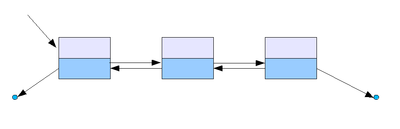

> 💡 자바스크립트로 이중 연결 리스트를 구현해보자.

# 개요 🛫

---

> 이번 포스트에서는 자바스크립트의 프로토타입 개념을 활용해서 이중 연결리스트를 구현할 것이다.

저번 포스트에서 연결리스트의 정의와 동작원리를 이해하고 메서드를 구현해보았는데, 이전 노드의 위치라는 개념이 더해진 이중 연결리스트를 이해해보고 동일하게 메서드를 구현해보았다.

이중 연결리스트 기능은

- 노드 출력(정/역방향)
- 노드 추가
- 특정 인덱스 노드 추가
- 노드 삭제
- 특정 인덱스 노드 삭제
- 특정 노드 인덱스 출력

정도로 구현하고자 한다.

# 학습 내용 📖

---

## 이중 연결 리스트란

### 연결 리스트의 정의

추상적 자료형인 리스트를 구현한 자료구조로, Linked List라는 말 그대로 어떤 데이터 덩어리(이하 노드Node)를 저장할 때 그 다음 순서의 자료가 있는 위치를 데이터에 포함시키는 방식으로 자료를 저장한다.

> 이중 연결 리스트는 위와 같은 연결리스트의 개념에 더해 그 다음 순서의 자료 뿐만아니라 이전 자료의 위치를 데이터에 포함시킨다.



### 이중 연결 리스트의 장점

> 이중 연결 리스트는 단일 연결 리스트의 단점인 손상을 방지할 수 있다.

배열 대비 `이중 연결 리스트`가 가진 장점은 이전 포스트에서 다룬 내용과 동일하고, 추가적으로 아래같은 손상에 강하다는 장점이 있다.

> `이중 연결 리스트는` Head와 Tail노드를 갖고 있다면 둘 중 하나를 가지고 전체 리스트를 순회할 수 있기 때문에 끊어진 체인을 복구하는 게 가능하다. 단일 연결 리스트는 Tail노드로는 리스트 순회가 불가능하고 Head노드 유실시 전체 자료를 다 잃어버린다.

---

## 이중 연결리스트 구현 with javascript

> 개요에서 설명한대로 자바스크립트로 연결리스트와 메서드들을 구현한다.

### 1. 이중 연결리스트 구현

Node와 LinkedList 객체를 함수로 구현하고, 프로토타입 메서드들을 선언한다.

```javascript
// Data와 pointer인 next, prev를 가지고 있는 Node 객체
function Node(data) {
  this.data = data;
  this.next = null;
  this.prev = null;
}

// Head, tail, length를 가지고 있는 DoublyLinkedList 객체
function DoublyLinkedList() {
  this.head = null;
  this.tail = null;
  this.length = 0;
}
```

### 2. Size 메서드

연결 리스트 내에 노드의 개수를 출력하는 Size 메서드

```javascript
// 연결 리스트 내 노드 개수 확인
DoublyLinkedList.prototype.size = function () {
  return this.length;
};
```

### 3. isEmpty 메서드

연결 리스트 내에 노드 존재 여부를 파악하는 isEmpty 메서드

```javascript
// 객체 내 노드 존재 여부 파악
DoublyLinkedList.prototype.isEmpty = function () {
  return this.length === 0;
};
```

### 4. printNode 메서드

이중 연결 리스트 내에 노드를 정방향으로 출력하는 printNode 메서드

`data -> data -> data -> ... -> null`

```javascript
// 노드 정방향 출력
DoublyLinkedList.prototype.printNode = function () {
  process.stdout.write("head -> ");
  for (let node = this.head; node != null; node = node.next) {
    process.stdout.write(`${node.data} ->`);
  }
  console.log("null");
};
```

### 5. printNodeInverse 메서드

이중 연결 리스트 내에 노드를 역방향으로 출력하는 printNode 메서드

```javascript
// 노드 역방향 출력
DoublyLinkedList.prototype.printNodeInverse = function () {
  let temp = [];
  process.stdout.write("null <- ");
  for (let node = this.tail; node != null; node = node.prev) {
    temp.push(node.data);
  }
  for (let i = temp.length - 1; i >= 0; i--) {
    process.stdout.write(`${temp[i]} <-`);
  }
  console.log("tail");
};
```

### 6. append 메서드

연결 리스트 가장 끝에 노드를 추가하는 append 메서드

```javascript
// 연결리스트의 마지막에 노드 추가
DoublyLinkedList.prototype.append = function (value) {
  let node = new Node(value);

  if (this.head === null) {
    this.head = node;
    this.tail = node;
  } else {
    this.tail.next = node;
    node.prev = this.tail;
    this.tail = node;
  }

  this.length++;
};
```

### 7. insert 메서드

연결 리스트의 특정 index(position)에 노드를 추가하는 insert 메서드

두 번째 인자를 비우면 0번, 즉 맨 앞에 노드를 추가한다.

```javascript
// position 위치에 노드 추가
DoublyLinkedList.prototype.insert = function (value, position = 0) {
  if (position < 0 || position > this.length) {
    return false;
  }

  let node = new Node(value);
  let current = this.head;
  let index = 0;
  let prev; // 이전 노드 값 저장

  if (position === 0) {
    if (this.head === null) {
      this.head = node;
      this.tail = node;
    } else {
      node.next = current;
      current.prev = node;
      this.head = node;
    }
  } else if (position === this.length) {
    current = this.tail;
    current.next = node;
    node.prev = current;
    this.tail = node;
  } else {
    while (index++ < position) {
      prev = current;
      current = current.next;
    }
    node.next = current;
    prev.next = node;

    current.prev = node;
    node.prev = prev;
  }
  this.length++;

  return true;
};
```

### 8. remove 메서드

연결 리스트 내에 value 데이터를 찾아 노드를 삭제하는 remove 메서드

```javascript
// value 값 노드 remove
DoublyLinkedList.prototype.remove = function (value) {
  let current = this.head;
  let prev = current;

  while (current.data != value && current.next != null) {
    prev = current;
    current = current.next;
  }

  if (current.data != value) {
    return null;
  }

  if (current === this.head) {
    this.head = current.next;
    if (this.length === 1) this.tail = null;
    else this.head.prev = null;
  } else if (current === this.tail) {
    this.tail = current.prev;
    this.tail.next = null;
  } else {
    prev.next = current.next;
    current.next.prev = prev;
  }

  this.length--;

  return current.data;
};
```

### 9. removeAt 메서드

연결 리스트 내에 해당 index(position)의 노드를 삭제하는 removeAt 메서드

```javascript
// removeAt() : position 위치 노드 삭제
DoublyLinkedList.prototype.removeAt = function (position = 0) {
  if (position < 0 || position >= this.length) {
    return null;
  }

  let current = this.head;
  let index = 0;
  let prev;

  if (position === 0) {
    this.head = current.next;
    if (this.length === 1) this.tail = null;
    else this.head.prev = null;
  } else if (position === this.length - 1) {
    current = this.tail;
    this.tail = current.prev;
    this.tail.next = null;
  } else {
    while (index++ < position) {
      prev = current;
      current = current.next;
    }
    prev.next = current.next;
    current.next.prev = prev;
  }

  this.length--;

  return current.data;
};
```

### 10. indexOf 메서드

연결 리스트 내에 value 데이터 값의 index를 찾아주는 indexOf 메서드

```javascript
// value 값을 갖는 노드의 index 반환
DoublyLinkedList.prototype.indexOf = function (value) {
  let current = this.head;
  let index = 0;

  while (current != null) {
    if (current.data === value) {
      return index;
    }

    index++;
    current = current.next;
  }

  return -1;
};
```

---

# Review 💡

이번 포스트에는 이중 연결 리스트의 정의와 장/단점을 알아보고, 자바스크립트로 구현까지 해보았다.

다음은 원형 연결 리스트를 구현해볼 예정이다.
