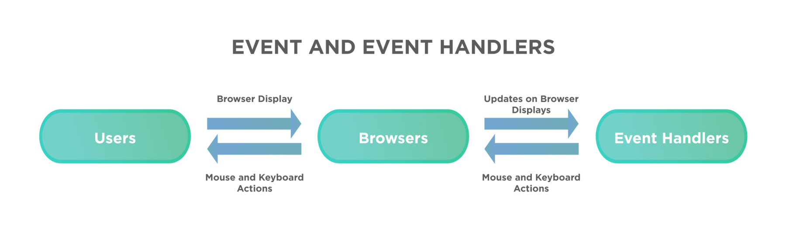
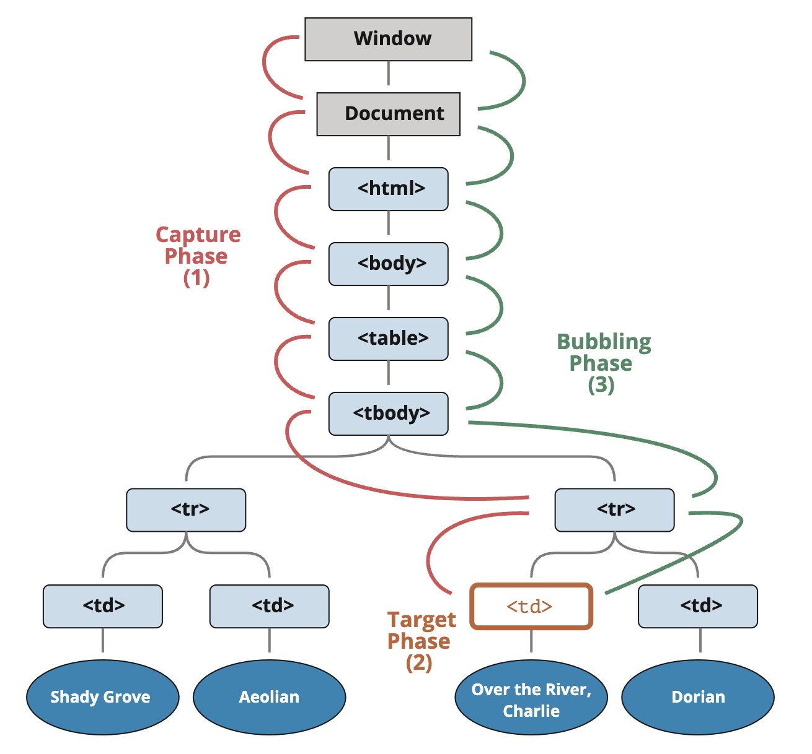

> 💡 이 포스팅은 이벤트 버블링/캡쳐링 대해 공부하며 정리한 내용입니다. 혹여나 일부 올바르지 않은 정보가 있을 시에 지적해주시면 정정토록하겠습니다.

# 개요 🛫

> 이벤트 버블링과 캡쳐링, 위임에 대해 공부하고, 간단한 예제를 작성합니다.

이번 포스팅에서는 이벤트가 발생할 때 일어나는 특징인 버블링과 캡쳐링에 대해 정리하고, 이벤트 위임을 통해 효과적으로 웹을 제어하는 방법을 다루고자 한다.

---

# Event 🎃



> 출처 - https://www.toolsqa.com/javascript/event-handlers-in-javascript/

`이벤트(event)`는 모든 DOM 노드에서 만들어낼 수 있는 신호이다.

```html
<button>버튼</button>
```

유저가 위 버튼을 `클릭`하면 버튼 태그는 `click` 이벤트를 발생 시킨다.

우리는 위와 같이 DOM 노드에서 이벤트가 발생할 때 특정 함수를 작동시킬 수 있는데, 그 함수를 `핸들러(handler)` 라고한다.

핸들러를 할당하는 방법은 아래와 같이 세 가지가 있다.

- HTML 속성: onclick="...".
- DOM 프로퍼티: elem.onclick = function.
- **메서드**: elem.addEventListener(event, handler[, phase])로 핸들러를 추가하고, removeEventListener 로 핸들러를 제거함

HTML 속성을 이용한 이벤트 핸들러 할당은 자주 쓰이지 않는다.

- 긴 코드를 끼워 넣는 게 불가능하다.

DOM 프로퍼티를 사용한 방법은 쓰일 수 있다.

- 여러 핸들러 할당이 불가능하다는 단점이 있다.

메서드를 사용하는 방법이 가장 유연하다.

- `transitionend`와 `DOMContentLoaded` 같은 일부 이벤트는 이 방법으로만 처리할 수 있다.

```javascript
document.querySelector("button").addEventListener("click", handler);

const handler = () => {
  alert("버튼을 클릭했다.");
};
```

> 메서드를 통한 이벤트 핸들러 할당

## 이벤트 흐름

> 이벤트 캡쳐링 -> 타깃 단계 -> 이벤트 버블링



---

## 이벤트 버블링 🛁

> 이벤트 버블링은 특정 화면 요소에서 이벤트가 발생했을 때 해당 이벤트가 더 상위의 화면 요소들로 전달되어 가는 특성을 의미한다.

<svg xmlns="http://www.w3.org/2000/svg" width="353" height="216" viewBox="0 0 353 216"><defs><style>@import url(https://fonts.googleapis.com/css?family=Open+Sans:bold,italic,bolditalic%7CPT+Mono);@font-face{font-family:&apos;PT Mono&apos;;font-weight:700;font-style:normal;src:local(&apos;PT MonoBold&apos;),url(/font/PTMonoBold.woff2) format(&apos;woff2&apos;),url(/font/PTMonoBold.woff) format(&apos;woff&apos;),url(/font/PTMonoBold.ttf) format(&apos;truetype&apos;)}</style></defs><g id="dom" fill="none" fill-rule="evenodd" stroke="none" stroke-width="1"><g id="event-order-bubbling.svg"><path id="Rectangle-210" fill="#DBAF88" d="M159.488 140L174 186H60l14.512-46z"/><path id="Rectangle-209" stroke="#91C2A3" stroke-width="18" d="M173.634 81l16.09 51H43.276l16.09-51h114.267z"/><path id="Rectangle-208" stroke="#EFA39F" stroke-width="18" d="M39.986 29h153.028l22.71 72H17.276l22.71-72z"/><path id="Fill-46" fill="#166388" d="M121.5 141v13.816a4.5 4.5 0 11-9 0V141h9zm0-31v13h-9v-13h9zM117 20.53a4.471 4.471 0 013.362 1.3l17.64 17.64a4.5 4.5 0 01-6.364 6.364L121.5 35.698V92h-9V35.7l-10.138 10.136a4.5 4.5 0 11-6.363-6.364l17.639-17.64a4.477 4.477 0 013.363-1.3z"/><text id="1" fill="#643B0C" font-family="PTMono-Bold, PT Mono" font-size="14" font-weight="bold"><tspan x="210" y="105">1</tspan></text><text id="2" fill="#643B0C" font-family="PTMono-Bold, PT Mono" font-size="14" font-weight="bold"><tspan x="185" y="136">2</tspan></text><text id="3" fill="#C06334" font-family="PTMono-Bold, PT Mono" font-size="14" font-weight="bold"><tspan x="157" y="181">3</tspan></text><text id="Most-deeply-nested-e" fill="#AF6E24" font-family="OpenSans-Bold, Open Sans" font-size="14" font-weight="bold"><tspan x="233.48" y="175">Most deeply</tspan> <tspan x="221.306" y="194">nested element</tspan></text><path id="Line-30" stroke="#C06334" stroke-dasharray="3,6" stroke-linecap="square" stroke-width="2" d="M179.5 177.5h30"/></g></g></svg>

```HTML
<form onclick="alert('form')">FORM
  <div onclick="alert('div')">DIV
    <p onclick="alert('p')">P</p>
  </div>
</form>
```

위 코드에서 `p` 태그를 클릭하면

- `<p>`에 할당된 onclick 핸들러가 동작.
- 바깥의 `<div>`에 할당된 핸들러가 동작.
- 그 바깥의 `<form>`에 할당된 핸들러가 동작.

> 거의 모든 이벤트는 버블링 된다.
> `focus` 이벤트와 같이 버블링 되지 않는 이벤트가 있다.

### 버블링 중단: event.stopPropagation()

> 이벤트를 처리한 뒤 버블링을 중단하는 명령.

버블링 중단을 남용해서는 안된다. 예를 들어..

유저 행동 패턴을 분석하는 시스템을 도입하는 등, document의 전체 클릭 이벤트를 감지해야할 때 `버블링`이 중단되어있는 상위 요소들은 `죽은 영역`이 된다.

---

## 이벤트 캡쳐링 💡

> 이벤트 캡쳐는 이벤트 버블링과 반대 방향으로 진행되는 이벤트 전파 방식이다. 상위에서 더 하위의 요소들로 전달된다.

```HTML
<form>FORM
  <div>DIV
    <p>P</p>
  </div>
</form>
<script>
  for(let elem of document.querySelectorAll('*')) {
    elem.addEventListener("click", e => alert(`캡쳐링: ${elem.tagName}`), true);
  }
</script>
```

위 코드에서 `form` 태그를 클릭하면

- `<form>`에 할당된 핸들러가 동작.
- 안쪽의 `<p>`에 할당된 onclick 핸들러가 동작.
- 안쪽의 `<div>`에 할당된 핸들러가 동작.

버블링과 반대로 상위 요소가 들어가며 아래 이벤트 핸들러들을 실행시킨다.

캡쳐링 단계에서 이벤트를 잡아내려면 `addEventListener`의 `capture` 옵션을 `true`로 설정해야 한다.

```javascript
document.addEventListener("click", handlar, true);
```

> 이벤트 캡쳐링은 잘 사용되지 않는다. 이유는 상위 요소에서 하위 요소로 이벤트가 전파되는 것 보다 하위 요소에서 상위 요소로 전파되는 것(버블링)이 더 많은 정보를 가지고 있기 때문이다.

---

## 이벤트 위임 🎓

> 이벤트 위임은 캡처링과 버블링을 활용한 강력한 핸들링 패턴이다.

공통 조상에 핸들러를 할당하고, event.target으로 실제로 어디서 이벤트가 발생했는지 알 수 있다.

> ref: Modern Javascript tutorial

위 예제 코드에서 클릭된 `td`의 색을 변경하고 싶다면,

1. 공통 조상인 `table`에 이벤트 핸들러를 할당하고
2. event.target을 이용해 어떤 요소가 클릭 되었는지 감지하고
3. 클릭된 요소가 `td`가 아닐 시 `return` 시킨다.
4. `td`가 맞다면 `event.target.classList`의 클래스 조정으로 상태를 바꾼다.

---

## 이벤트 위임 활용 🔧

> event.target으로 처리하는 방법도 있지만, data-action과 같은 속성을 추가해는 방법도 있다.

### data-action

> data-action에 할당한 문자열을 함수로 구현해 이벤트를 발생시킬 수 있다.

```HTML
<div id="menu">
  <button data-action="save">저장하기</button>
  <button data-action="load">불러오기</button>
  <button data-action="search">검색하기</button>
</div>

<script>
  class Menu {
    constructor(elem) {
      this._elem = elem;
      elem.onclick = this.onClick.bind(this); // (*)
    }

    save() {
      alert('저장하기');
    }

    load() {
      alert('불러오기');
    }

    search() {
      alert('검색하기');
    }

    onClick(event) {
      let action = event.target.dataset.action;
      if (action) {
        this[action]();
      }
    };
  }

  new Menu(menu);
</script>
```

### data-counter

> 버튼을 클릭하면 숫자가 증가하는 행동을 부여해주는 속성인 data-counter가 있다.

```HTML
첫 번째 카운터: <input type="button" value="1" data-counter>
두 번째 카운터: <input type="button" value="2" data-counter>

<script>
  document.addEventListener('click', function(event) {

    if (event.target.dataset.counter != undefined) { // 속성이 존재할 경우
      event.target.value++;
    }

  });
</script>
```

### toggler

> data-toggle-id 속성이 있는 요소를 클릭하면 속성값이 id인 요소를 나타거나 사라지게할 수 있다.

```HTML
<button data-toggle-id="subscribe-mail">
	버튼
</button>

<form id="subscribe-mail" hidden>
	토글 요소
</form>

<script>
  document.addEventListener('click', function(event) {
    let id = event.target.dataset.toggleId;
    if (!id) return;

    let elem = document.getElementById(id);

    elem.hidden = !elem.hidden;
  });
</script>
```

### 이벤트 위임의 장/단점

**이벤트 위임의 장점:**

- 많은 핸들러를 할당하지 않아도 되기 때문에 메모리 최적화에 도움이 된다.
- 요소를 추가하거나 제거할 때 해당 요소에 할당된 핸들러를 추가하거나 제거할 필요가 없기 때문에 코드가 짧아진다.
- innerHTML과 같은 메서드로 요소를 더하거나 뺄 수 있기 때문에 DOM 수정이 자유롭다.

**이벤트 위임의 단점:**

- 이벤트 위임을 사용하려면 이벤트가 반드시 버블링 되어야 하지만, 버블링 되지 않는 이벤트들이 있다.
- event.stopPropagation()를 쓸 수 없다.
- 부모에 할당된 핸들러가 모든 하위 컨테이너에서 발생하는 이벤트에 응답해야 하므로 CPU 작업 부하가 늘어날 수 있.
  ~~이런 부하는 무시할만한 수준이므로 실제로는 잘 고려하지 않는다고 한다.~~

---

# References 🙏🏽

- [mdn web docs](https://developer.mozilla.org/ko/docs/Web/API/Document_Object_Model/Introduction)
- [모던 javaScript 튜토리얼](https://ko.javascript.info/)
