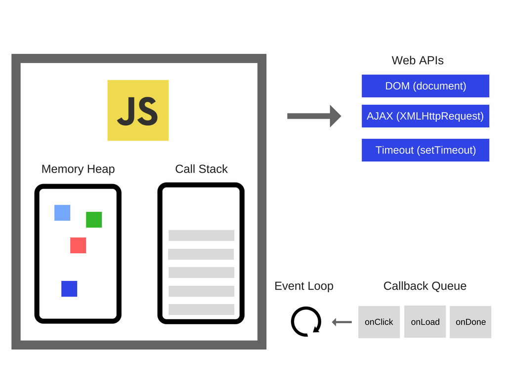
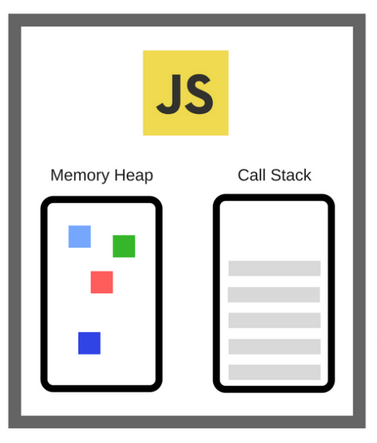
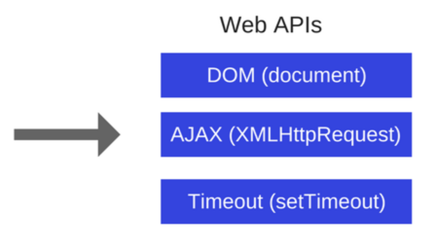
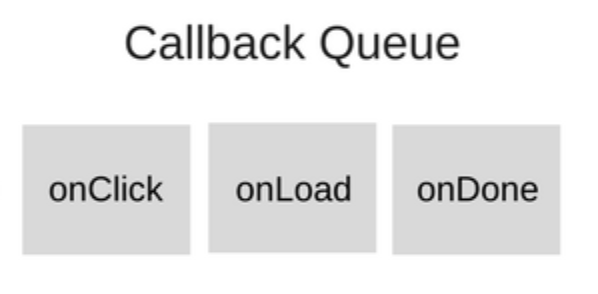
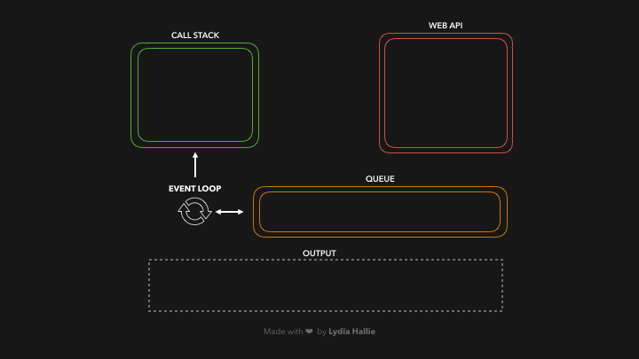

> 💡 이 포스팅은 자바스크립트의 이벤트 루프에대해 공부하며 정리한 내용입니다. 혹여나 일부 올바르지 않은 정보가 있을 시에 지적해주시면 정정토록하겠습니다.

# 개요 🛫

> 이벤트 루프에대해 공부하고 정리합니다.

이번 포스팅에서는 브라우저의 싱글 스레드 동작이 정확히 어떻게 이루어지는지 이해하고. 이벤트 루프, 콜 스택, 테스크 큐 등 자바스크립트가 코드를 처리하는 동작들에대해 정리해봅니다.

---

# Event Loop ➰

> `이벤트 루프(event loop)`는 task가 들어오길 기다렸다가 태스크가 들어오면 이를 처리하고, 처리할 task가 없는 경우엔 잠드는, 끊임없이 돌아가는 자바스크립트 내 루프이다.

위 정의만 보면 프로그램의 task가 어디로 들어가서 어떻게 처리된다는건지 이해하기가 힘들다.

**이벤트 루프**를 이해하기 위해서는 자바스크립트라는 코드가 어떻게 동작되는지부터 이해해야한다.

> 이미지 출처: https://blog.sessionstack.com/how-does-javascript-actually-work-part-1-b0bacc073cf

위 이미지를 참고로하여 정리해보겠다.

## Javascript Engine

> 자바스크립트 엔진은 `Call Stack`과 `Memory Heap`으로 구성되어있다.

구글의 V8 Engine과 같은 **자바스크립트 엔진**은 `Call Stack`과 `Memory Heap`으로 구성되어있다.

- **Memory Heap** : 변수, 함수등이 담기고 메모리가 할당되는 공간.
- **Call Stack** : `Task`들이 쌓이는 Stack

자바스크립트는 한 번에 하나의 작업만 처리하는 `싱글 스레드 언어`이다.

이것은 하나의 `Call Stack`을 가졌다는 의미이기도 한데, 엔진은 이벤트 루프를 통해 `동시성`을 지원할 수 있는 것이다.

## Web APIs

> Web APIs는 자바스크립트 엔진과 별도로 존재한다. (브라우저 지원)

**Web APIs** 는 브라우저에서 지원하는 API의 집합이다.
흔히 사용하는 `Ajax`, `Fetch`, `setTimeout` 등이 그것이다.

`Call Stack`에서 실행된 비동기 함수는 Web API를 호출하고, Web API는 콜백함수를 `콜백 큐`에 보관한다.

## Callback Queue (=== Event === Macrotask)

> Callback Queue, Event Queue, Macrotask Queue 등으로 불린다. Queue 자료구조로 구현되어있다.

**Callback Queue**는 비동기적으로 실행되는 콜백함수가 보관되는 영역이다.

`Web APIs`에서 호출되는 비동기 함수들은 `Callback Queue`에 보관된다. (ex `setTimeout(cb, 0)`, `addEventListener('onClick', cb)`)

## Job Queue (=== Microtask)

> Job Queue, Microtask Queue 등으로 불린다.

위 그림에는 나와있지 않지만. ECMA 2015에서 나온 **Job Queue**라는 영역도 존재한다.

이것은 `Callback Queue`와 동일한 역할을 하지만, Promise에 의해 사용된다는 차이점이 있다.

쉽게 이해하자면, Promise의 then()의 콜백은 `Callback Queue`가 아닌 `Job Queue`에 보관되며, 콜백 큐보다 높은 우선순위로 실행된다.

## Event Loop

> `Callback Queue`와 `Job Queue`에 보관되어 있는 비동기 콜백 함수들을 자바스크립트 엔진의 `Call Stack`에 넣어준다.

**Event Loop**에서 Loop의 사전적인 의미는 '반복, 순환'이다.

Event Loop는 사전적인 의미처럼 계속 반복해서 `Call Stack`과 `Queue`(`Callback Queue` or `Job Queue`) 사이의 상태를 확인하고, `Call Stack`이 비워있는 경우 `Queue`에서 `task`를 꺼내어 `Call stack`에 넣는다.

쉽게 이해하자면, Web API나 Promise로 비동기 동작을하는 콜백 함수가 `Callback Queue`나 `Job Queue`에 들어와 있고, 자바스크립트 엔진의 `Call Stack`이 빈 상태가 되면 `task`를 넣어주는 역할을 한다.

이런 `Loop`. 즉, 반복적인 행동을 이벤트 루프의 **틱(tick)** 이라 부른다.

---

# Event Loop의 동작

> 코드가 실행될 때 위 설명한 영역들이 어떤 역할을 하며, 어떻게 동작하는지 정리한다.

1. **V8 엔진**에서 코드가 실행되면, `Call Stack`에 task가 쌓인다.

2. `Call Stack`에서는 순차적으로 Stack을 Pop하며 함수들이 실행된다.

3. Call Stack에 쌓인 task 중에 비동기함수가 실행된다면, `Web API`가 호출된다.

   3-1. 이 중 Promise로 구현된 task는 `Job Queue`로 이동한다.

4. `Web API`는 비동기함수의 콜백함수를 바로 실행시키지 않고, 특정 조건(ex setTimeout)이 달성되면 `Callback Queue`로 이동시킨다.

5. Event Loop는 `Call Stack`의 상태를 확인하고, Call Stack이 비어있다면 `Callback Queue`에 있는 첫번째 콜백을 `Call Stack`으로 이동시킨다.

   5-1. Event Loop는 `Callback Queue` 보다 `Job Queue`의 상태를 우선적으로 확인하고, 먼저 `Call Stack`으로 이동시킨다.

> 이러한 동작 방식이 자바스크립트가 단일 스레드 언어임에도 불구하고 멀티 스레드 언어처럼 보이게 되는 것이다.

시각적으로 이벤트 루프의 동작 원리를 확인하고 싶다면 아래 링크에서 코드를 작성하고 실행해보자.

[Loupe - Philip Roberts](http://latentflip.com/loupe/?code=JC5vbignYnV0dG9uJywgJ2NsaWNrJywgZnVuY3Rpb24gb25DbGljaygpIHsKICAgIHNldFRpbWVvdXQoZnVuY3Rpb24gdGltZXIoKSB7CiAgICAgICAgY29uc29sZS5sb2coJ1lvdSBjbGlja2VkIHRoZSBidXR0b24hJyk7ICAgIAogICAgfSwgMjAwMCk7Cn0pOwoKY29uc29sZS5sb2coIkhpISIpOwoKc2V0VGltZW91dChmdW5jdGlvbiB0aW1lb3V0KCkgewogICAgY29uc29sZS5sb2coIkNsaWNrIHRoZSBidXR0b24hIik7Cn0sIDUwMDApOwoKY29uc29sZS5sb2coIldlbGNvbWUgdG8gbG91cGUuIik7!!!PGJ1dHRvbj5DbGljayBtZSE8L2J1dHRvbj4%3D)

---

# References 🙏🏽

- [MDN web docs](https://developer.mozilla.org/ko/docs/Web/API/Document_Object_Model/Introduction)
- [The Modern javaScript Tutorial](https://ko.javascript.info/)
- [How JavaScript works: an overview of the engine, the runtime, and the call stack](https://blog.sessionstack.com/how-does-javascript-actually-work-part-1-b0bacc073cf)
- [What the heck is the event loop anyway? | Philip Roberts | JSConf EU](https://www.youtube.com/watch?v=8aGhZQkoFbQ&t=1097s)
