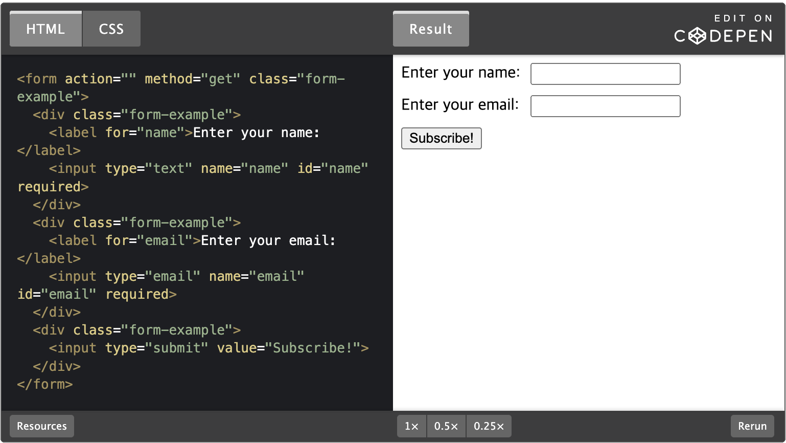
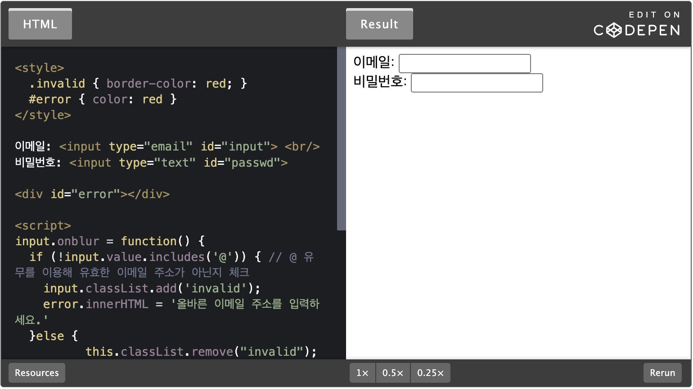
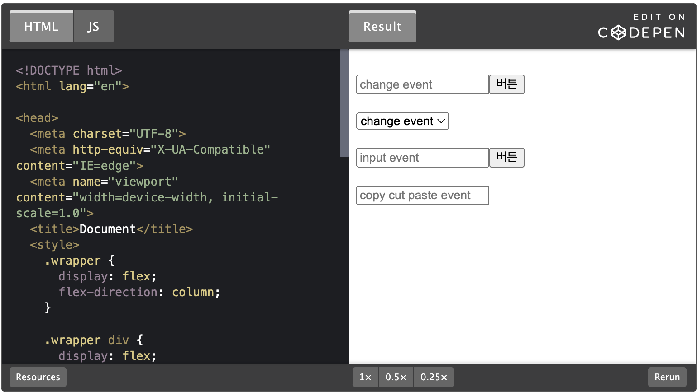
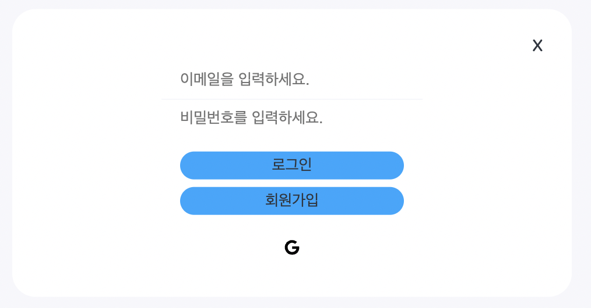

> 💡 이 포스팅은 폼(Form) 대해 공부하며 정리한 내용입니다. 혹여나 일부 올바르지 않은 정보가 있을 시에 지적해주시면 정정토록하겠습니다.

# 개요 🛫

> 폼과 폼 이벤트에 대해 공부하고, 내용을 정리합니다.

이번 포스팅에서는 폼에 대한 것들을 정리하고, 간단한 예제를 작성해봅니다.

---

# Form 📜

> HTML의 `Form` (이하 폼) 은 정보를 제출하기 위한 문서 구획을 나타낸다.

폼의 기본적인 예시

[Example - General Form](https://codepen.io/task11/pen/GRQjoQE)



## 폼 요소

> 폼 조작에 사용되는 요소들을 정리해보자.

### input / textarea

> input과 textarea 요소의 값은 input.value (string) 또는 input.checked(boolean)을 사용해 얻을 수 있다.

```javascript
input.value = "value";
textarea.value = "text";

input.checked = true; // 체크박스나 라디오 버튼에서 쓸 수 있음.
```

> textarea.innerHTML 말고 textarea.value를 사용해야 한다.

**textarea.innerHTML엔 페이지를 처음 열 당시의 HTML만 저장되어 최신 값을 구할 수 없기 때문에, textarea 안의 값이 HTML이더라도 값을 얻을 때 innerHTML을 사용하지 않는다.**

### select / option

> select 요소의 프로퍼티는 아래와 같다.

- select.options – option 하위 요소를 담고 있는 컬렉션
- select.value – 현재 선택된 option 값
- select.selectedIndex – 현재 선택된 option의 번호(인덱스)

위 세 프로퍼티를 응용하면 select의 값을 설정할 수 있다.

```HTML
<select id="select">
  <option value="a">a</option>
  <option value="b">b</option>
  <option value="c">c</option>
</select>

<script>
  console.log(select.options[2].selected); // true
  console.log(select.selectedIndex); // 2
  console.log(select.value) // "b"

</script>
```

### focus / blur

> focus 이벤트는 요소가 포커스를 받을 때, blur 이벤트는 포커스를 잃을 때 발생한다.

위 이벤트들은 입력 필드 값의 검증이 필요할 때 사용할 수 있습니다.

**예제**

[Example - Validation by fous & blur event](https://codepen.io/task11/pen/qBxaaPE)



### change, input, cut, copy, paste

> 데이터가 변경될 때 실행되는 이벤트에 대해 알아보자.

- `onchange`

onchange or change 이벤트는 요소 변경이 끝나면 발생한다.

텍스트 입력 요소인 경우에는 요소 변경이 끝날 때가 아니라 포커스를 잃을 때 이벤트가 발생한다.

보통 select 요소에 사용되는 이벤트이다.
(ReactJS의 onChange와 다르다)

[ReactJS의 onChange에 대한 참조 글 링크](http://daplus.net/javascript-react%EC%97%90%EC%84%9C-onchange%EC%99%80-oninput%EC%9D%98-%EC%B0%A8%EC%9D%B4%EC%A0%90%EC%9D%80-%EB%AC%B4%EC%97%87%EC%9E%85%EB%8B%88%EA%B9%8C/)

- `oninput`

oninput 이벤트는 사용자가 값을 수정할 때마다 발생한다.

키보드 이벤트와 달리 input 이벤트는 어떤 방법으로든 값을 변경할 때 발생한다.(실시간)

(ReactJS의 onChange와 비슷하다.)

- `cut` `copy` `paste`
  cut, copy, paste 이벤트는 각각 값을 잘라내기·복사하기·붙여넣기 할 때 발생한다.

위 이벤트들은 ClipboardEvent 클래스의 하위 클래스이다.

`event.preventDefault()`를 사용해 기본 동작을 막음으로써 복사, 붙여넣기를 제한할 수 있다.

**예제**

[Example - PreventDefault](https://codepen.io/task11/pen/abqmBRw)



---

# 사용 예시

> 개인 프로젝트에서 사용하고 있는 로그인 폼 예시



# References 🙏🏽

- [mdn web docs](https://developer.mozilla.org/ko/docs/Web/API/Document_Object_Model/Introduction)
- [모던 javaScript 튜토리얼](https://ko.javascript.info/)
