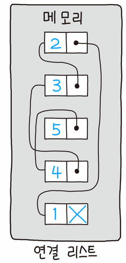

> 💡 자바스크립트로 연결 리스트를 구현해보자.

# 개요 🛫

---

> 이번 포스트에서는 자바스크립트의 프로토타입 개념을 활용해서 연결리스트를 구현할 것이다.

연결리스트의 정의와 동작원리를 이해하고 메서드를 구현한다.

연결리스트 기능은

- 노드 출력
- 노드 추가
- 특정 인덱스 노드 추가
- 노드 삭제
- 특정 인덱스 노드 삭제
- 특정 노드 인덱스 출력

정도로 구현하고자 한다.

# 학습 내용 📖

---

## 연결 리스트란

### 연결 리스트의 정의

> 연결리스트 각 노드가 다음 노드에 연결되어있는 선형 자료구조이다.

추상적 자료형인 리스트를 구현한 자료구조로, Linked List라는 말 그대로 어떤 데이터 덩어리(이하 노드Node)를 저장할 때 그 다음 순서의 자료가 있는 위치를 데이터에 포함시키는 방식으로 자료를 저장한다.

**큐를 구현할 때 연결리스트를 사용한다.**



### 연결 리스트의 장점

> 자바스크립트에 배열이라는 좋은 자료구조를 두고 연결 리스트를 쓰는 이유가 있나?

배열 대비 `연결 리스트`가 가진 장점은 아래와 같다.

1. 배열은 배열이 길이 만큼 꽉 찬 상태에서 요소를 추가하면 배열의 길이의 두배에 해당하는 메모리를 미리 할당하여 그 만큼 불필요한 메모리를 사용하게 된다. (연결 리스트는 크기를 키우는데에 메모리 낭비가 적다.)

2. 배열은 push와 pop을 제외한 모든 배열의 요소 추가 및 제거 메서드에서 `O(n)`의 시간 복잡도를 가진다. 만약 첫 번째 인덱스에 요소를 추가해야 할 경우 나머지 모든 요소들을 오른쪽으로 한 칸씩 옮겨야한다. (연결 리스트는 첫 번째 인덱스에 요소 추가 시 `O(1)`)

> 데이터의 추가/삭제가 많을 때 `연결리스트`자료구조가 효율적이다.
> 반대로 정렬/탐색이 많을 때 `배열`이 효율적이다.

### 연결 리스트의 단점

> 단순 연결 리스트의 단점

`연결 리스트`가 가진 단점은 아래와 같다.

1. 순차적으로 탐색하지 않으면 특정 위치의 요소에 접근할 수가 없어 일반적으로 탐색 속도가 떨어진다. 특정 노드를 접근/탐색하는데 `O(n)`의 시간복잡도를 가진다. (배열은 `O(1)`)

2. Head노드를 참조하는 주소를 잃어버릴 경우 데이터 전체를 못 쓰게 되는 단점이 있다. 다음 노드를 참조하는 주소 중 하나가 잘못되는 경우에도 체인이 끊어진 양 거기부터 뒤쪽 자료들을 유실한다. `안정적인 자료구조는 아니다.`

> 단순 연결리스트의 이런 단점들은 `이중연결리스트`, `원형연결리스트` 등의 자료구조들에서는 해결되는 경우가 있다. 다음 포스트에서 다뤄보겠다.

---

## 연결리스트 구현 with javascript

> 개요에서 설명한대로 자바스크립트로 연결리스트와 메서드들을 구현한다.

### 1. 연결리스트 구현

Node와 LinkedList 객체를 함수로 구현하고, 프로토타입 메서드들을 선언한다.

```javascript
// Data와 다음 가리키는 포인터인 Next를 가지고 있는 Node 객체
function Node(data) {
  this.data = data;
  this.next = null;
}

// 첫 번째 노드를 가리키는 Head와 총 길이인 Length를 가지고 있는 LinkedList 객체
function LinkedList() {
  this.head = null;
  this.length = 0;
}
```

### 2. Size 메서드

연결 리스트 내에 노드의 개수를 출력하는 Size 메서드

```javascript
// 연결 리스트 내에 노드 개수 확인
LinkedList.prototype.size = function () {
  return this.length;
};
```

### 3. isEmpty 메서드

연결 리스트 내에 노드 존재 여부를 파악하는 isEmpty 메서드

```javascript
// 객체 내에 노드 존재 여부 파악
LinkedList.prototype.isEmpty = function () {
  return this.length === 0;
};
```

### 4. printNode 메서드

연결 리스트 내에 노드를 출력하는 printNode 메서드

`data -> data -> data -> ... -> null`

```javascript
// 노드 출력
LinkedList.prototype.printNode = function () {
  for (let node = this.head; node != null; node = node.next) {
    process.stdout.write(`${node.data} -> `);
  }
  console.log("null");
};
```

### 5. append 메서드

연결 리스트 가장 끝에 노드를 추가하는 append 메서드

```javascript
// 연결 리스트 가장 끝에 노드 추가
LinkedList.prototype.append = function (value) {
  let node = new Node(value);
  let current = this.head;

  if (this.head === null) {
    this.head = node;
  } else {
    while (current.next != null) {
      current = current.next;
    }
    current.next = node;
  }

  this.length++;
};
```

### 6. insert 메서드

연결 리스트의 특정 index(position)에 노드를 추가하는 insert 메서드

두 번째 인자를 비우면 0번, 즉 맨 앞에 노드를 추가한다.

```javascript
// position위치에 노드 추가(default = 0)
LinkedList.prototype.insert = function (value, position = 0) {
  if (position < 0 || position > this.length) {
    return false;
  }

  let node = new Node(value);
  let current = this.head;
  let index = 0;
  let prev; // 이전 노드 값 저장

  if (position === 0) {
    node.next = current;
    this.head = node;
  } else {
    while (index++ < position) {
      prev = current;
      current = current.next;
    }
    node.next = current;
    prev.next = node;
  }
  this.length++;

  return true;
};
```

### 7. remove 메서드

연결 리스트 내에 value 데이터를 찾아 노드를 삭제하는 remove 메서드

```javascript
// value 데이터를 찾아 노드 삭제
LinkedList.prototype.remove = function (value) {
  let current = this.head;
  let prev = current;

  while (current.data != value && current.next != null) {
    prev = current;
    current = current.next;
  }

  if (current.data != value) {
    return null;
  }

  if (current === this.head) {
    this.head = current.next;
  } else {
    prev.next = current.next;
  }

  this.length--;

  return current.data;
};
```

### 8. removeAt 메서드

연결 리스트 내에 해당 index(position)의 노드를 삭제하는 removeAt 메서드

```javascript
// removeAt() : position 위치 노드 삭제
LinkedList.prototype.removeAt = function (position = 0) {
  if (position < 0 || position >= this.length) {
    return null;
  }

  let current = this.head;
  let index = 0;
  let prev;

  if (position == 0) {
    this.head = current.next;
  } else {
    while (index++ < position) {
      prev = current;
      current = current.next;
    }
    prev.next = current.next;
  }

  this.length--;

  return current.data;
};
```

### 9. indexOf 메서드

연결 리스트 내에 value 데이터 값의 index를 찾아주는 indexOf 메서드

```javascript
LinkedList.prototype.indexOf = function (value) {
  let current = this.head;
  let index = 0;

  while (current != null) {
    if (current.data === value) {
      return index;
    }

    index++;
    current = current.next;
  }

  return -1;
};
```

---

# Review 💡

이번 포스트에는 연결 리스트의 정의와 장/단점을 알아보고, 자바스크립트로 구현까지 해보았다.

단순 연결 리스트 자료구조를 학습했는데, 앞으로 이중 연결 리스트, 원형 연결 리스트, 큐, 스택 등 자료구조들을 정리하고 자바스크립트로 구현하는 포스트를 작성해볼 계획이다.

> 특정 기능이나 구조를 구현할 때 단순 배열이나 객체만을 사용했는데, 어떠한 데이터 집합의 특성을 파악하고 알맞는 자료구조를 사용하는게 성능 이슈 해결의 첫 걸음이 될 수도 있겠다는 생각이 들었다.
