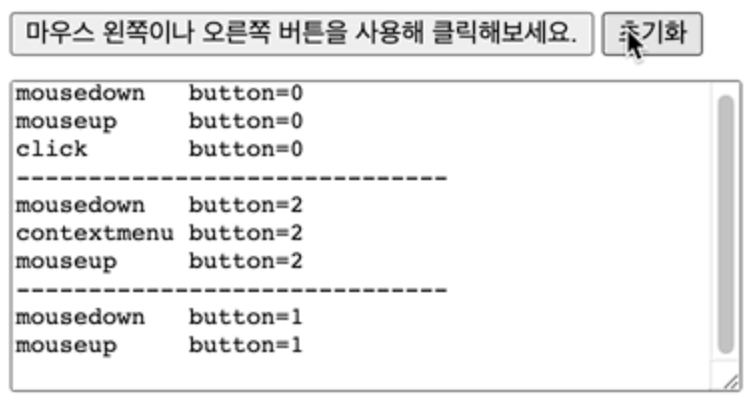

> 💡 이 포스팅은 이벤트 마우스 이벤트 중 드래그 앤 드롭 대해 공부하며 정리한 내용입니다. 혹여나 일부 올바르지 않은 정보가 있을 시에 지적해주시면 정정토록하겠습니다.

# 개요 🛫

> 마우스 이벤트와 드래그 앤 드롭에 대해 공부하고, 간단한 예제를 작성합니다.

이번 포스팅에서는 마우스 이벤트의 종류를 정리하고, 이벤트를 통해 드래그 앤 드랍 기능을 구현하는 예제를 작성합니다.

---

# Mouse Event 🎃

> `마우스 이벤트(mouse event)`는 마우스에서 일어나는 이벤트를 말하며, 테블릿이나 모바일 기기에서도 적용된다.



위 처럼 마우스 이벤트는 사용자가 단 하나의 동작을 했어도 실행되는 이벤트는 여러 개일 수 있다.

- ex) 왼쪽 클릭 시 : `mousedown` -> `mouseup` -> `click`

## 마우스 이벤트 종류

> 대표적인 마우스 이벤트 종류들이다.

- `mousedown·mouseup`: 요소 위에서 마우스 왼쪽 버튼을 누를 때, 마우스 버튼 누르고 있다가 뗄 때 발생.
- `mouseover`: 마우스 커서가 요소 바깥에 있다가 요소 안으로 움직일 때 발생.
- `mouseout`: 커서가 요소 위에 있다가 요소 밖으로 움직일 때 발생.
- `mousemove`: 마우스를 움직일 때 발생한다.
- `click`: 마우스 왼쪽 버튼을 사용해 동일한 요소 위에서 mousedown 이벤트와 mouseup 이벤트를 **연달아 발생**시킬 때 실행.
- `dblclick`: 동일한 요소 위에서 마우스 왼쪽 버튼을 빠르게 클릭할 때 발생. ~~요즘엔 잘 쓰이지 않음.~~
- `contextmenu`: 마우스 오른쪽 버튼을 눌렀을 때 발생.
  ===> 참고로 단축키를 통해 contextmenu가 나타나게 할 수는 있지만, contextmenu라는 마우스 이벤트와 동일하진 않다.

## clientX, clientY / pageX, pageY

> clientX, clientY와 pageX, pageY 마우스 이벤트는 두 종류의 좌표 정보를 지원한다.

`클라이언트 좌표`: clientX, clientY
`페이지 좌표`: pageX, pageY

- 클라이언트 좌표인 clientX와 clientY는 웹 문서를 기준으로 각각 왼쪽에서 얼마나 떨어져 있는지, 위에서 얼마나 떨어져 있는지를 나타낸다
  **페이지가 `스크롤` 되어도 값이 `변하지 않는다`.**

- 페이지 좌표인 pageX와 pageY는 창 왼쪽 위를 기준으로 얼마나 떨어져 있는지를 나타낸다.
  **페이지를 `스크롤`하면 값도 `변한다`.**

## 마우스 이벤트 막기

> 특정 페이지에서 글 내용을 긁어 복사하려고 할 때 긁어지지않는 경우를 다들 겪어 봤을 것이다. 이는 mousedown 이벤트를 막아 놓은 것이다.

```HTML
<b ondblclick="alert('클릭!')" onmousedown="return false">
	더블클릭해주세요. (드래그 방지)
</b>
```

mousedown 이벤트의 기본동작을 막아서 클릭이나 드래그 등이 안되는 것을 볼 수 있다.

---

# 드래그 앤 드롭 🖱

> 모던 HTML 표준에서는 `dragstart`, `dragend` 등에 대한 명세가 있다. 하지만 특정 영역에서 드래그하는 것을 막을 수 없고, 수평이나 수직으로만 드래그하는 것도 만들 수 없다. 모바일 환경에서의 지원도 많이 부족하기 때문에 자바스크립트로 직접 구현해서 사용해보겠다.

## 구현

> 드래그 앤 드롭의 기본 알고리즘은 다음과 같다.

`mousedown` -> 요소 사전 작업 -> `mouseup` -> 드롭 완료 작업 수행

- mousedown에서는 움직임이 필요한 요소를 준비한다.
- 기존 요소의 복사본을 만들거나, 해당 요소에 클래스를 추가하는 형태를 만든다.
- mousemove에서 position:absolute의 left∙top을 변경한다.
- mouseup에서는 드래그 앤 드롭 완료와 관련된 모든 작업을 수행한다.

## 예제 작성

> 브라우저의 기본 드래그 기능을 막아서 충돌을 방지한다.

```javascript
element.ondragstart = function () {
  return false;
};
```

> 클릭 시 마우스 좌표에 따라 요소가 움직이지 않게, 요소의 왼쪽, 위쪽 좌표를 빼준다.

```javascript
let shiftX = e.clientX - e.target.getBoundingClientRect().left;
let shiftY = e.clientY - e.target.getBoundingClientRect().top;
```

[Codepen Example](https://codepen.io/task11/pen/yLvNOMK)

위 예제는 main의 div 요소를 side bar로 전달해서 숨겨주는 기능을 한다.

드래그된 요소가 droppable한 side bar의 요소에 도착하면 요소를 삭제하고 side bar아래 새로운 요소를 삽입한다.
( 이 과정에서 animation이나 transition을 적용하고 싶었는데 잘 되지 않았다.)

~~side bar의 요소를 다시 꺼내오는 작업은 되어있지 않다.~~

---

# References 🙏🏽

- [mdn web docs](https://developer.mozilla.org/ko/docs/Web/API/Document_Object_Model/Introduction)
- [모던 javaScript 튜토리얼](https://ko.javascript.info/)
