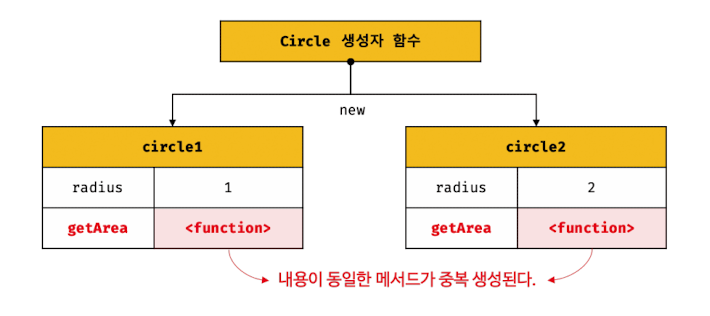
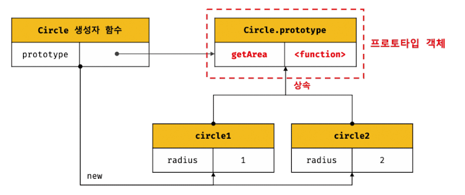
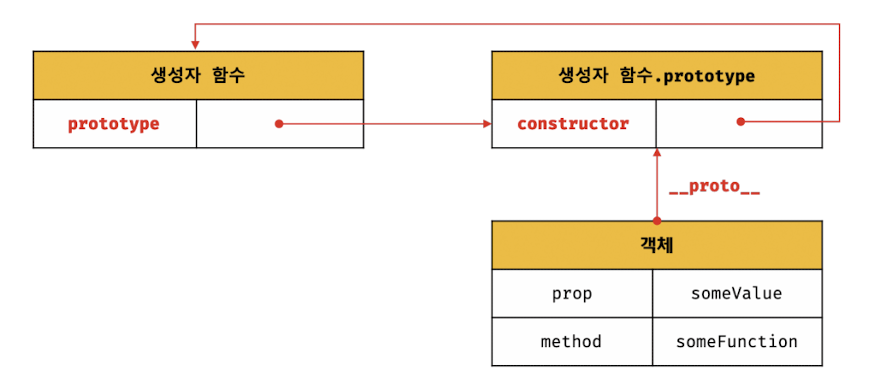
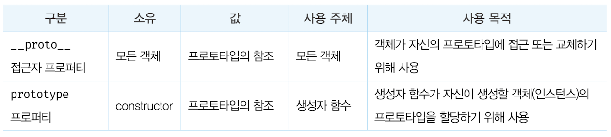

> 💡 자바스크립트 프로토타입 개념 이해하기

# 개요 🛫

---

> 이번 포스트에서는 자바스크립트 프로토타입을 이해할 수 있는 간단한 기저개념들과 프로토타입의 원리에 대해 공부한 점을 정리해보았다.

Modern Javascript Deep Dive라는 책을 구매하여 자바스크립트에대해 이해하는 시간을 가지고있다(이미지를 참조했다). Prototype이라는 개념을 이해하고 코드를 구성한다면 불필요한 중복이 제거된 활용성 있는 코드가 짜여질 것이다.

# 학습 내용 📖

---

## 프로토타입(Prototype)

자바스크립트는 멀티 패러다임 프로그래밍 언어이다.

- imperative : 명령형
- functional : 함수형
- prototype-based : 프로토타입 기반
- **OOP(Object Oriented Programming) : 객체지향 프로그래밍**

_**자바스크립트를 이루고 있는 거의 모든 것이 객체다.(원시 값 제외)**_

---

## OOP(객체 지향 프로그래밍)

여러 개의 독립적인 단위, 객체의 집합으로 프로그램을 표현하는 프로그래밍 패러다임.

사람은 이름, 나이, 성별, 주소 등 다양한 속성을 갖는다.

구현하려는 프로그램에 사람의 "이름"과 "나이" 속성이 필요하다고하면, 이것들만 추려서 표현하는 것을 **추상화(abstraction)** 라고한다.

> 객체의 정의 : **상태(state) -> 프로퍼티** 와 **동작(behavior) -> 메서드** 로 이루어져 있다.

- 속성을 통해 여러 개의 값을 하나의 단위로 구성한 복합적인 자료구조
- 상태 데이터와 동작을 하나의 논리적 단위로 묶은 복합적인 자료구조

---

## 상속과 프로토타입

상속(inheritance) : 어떤 객체의 프로퍼티 or 메서드를 다른 객체가 상속받아 그대로 사용할 수 있는 것.

_**자바스크립트는 프로토타입으로 상속을 구현하여 불필요한 중복을 제거한다.**_

**Example Code (중복된 메서드) :**

```javascript
// 생성자 함수
function Circle(radius) {
  this.radius = radius;
  this.getArea = function () {
    return Math.PI * this.radius ** 2;
  };
}

// 반지름이 1인 인스턴스 생성
const circle1 = new Circle(1);
// 반지름이 2인 인스턴스 생성
const circle2 = new Circle(2);

// Circle 생성자 함수는 인스턴스를 생성할 때마다 동일한 동작을 하는 getArea 메서드를 중복 생성하고 모든 인스턴스가 중복 소유한다.
// getAread 메서드는 하나만 생성하여 모든 인스턴스가 공유해서 사용하는 것이 바람직하다.(중복 코드)
console.log(circle.getArea === circle2.getArea); // flase
```

**메서드 중복**



모든 인스턴스가 동일한 메서드를 중복 소유하는 것은 메모리를 낭비하는 요소이다.
_**자바스크립트는 프로토타입으로 상속을 구현하여 불필요한 중복을 제거한다.**_

**Example Code (중복된 메서드) :**

```javascript
// 생성자 함수
function Circle(radius) {
  this.radius = radius;
}

// Circle 생성자 함수가 생성한 모든 인스턴스가 getArea 메서드를 공유해서 사용할 수 있도록 프로토타입에 추가한다.
// 프로토타입은 Circle 생성자 함수의 prototype 프로퍼티에 바인딩되어 있다.
Circle.prototype.getArea = function () {
  return Math.PI * this.radius ** 2;
};

// 인스턴스 생성
const circle1 = new Circle(1);
const circle2 = new Circle(2);

// Circle 생성자 함수가 생성한 모든 인스턴스는 부모 객체 역할을 하는 프로토타입(Circle.prototype)으로부터 getArea 메서드를 상속받는다.
// getAread 메서드는 하나만 생성되어 모든 인스턴스가 공유한다(중복 코드)
console.log(circle1.getArea === circle2.getArea); // true
```

**프로토타입 기반의 상속을 통한 메서드 공유**



_**상속은 코드의 재사용이라는 관점에서 유용하다.**_

---

## 프로토타입 객체

- 모든 객체는 하나의 프로토타입을 갖는다.
- 모든 프로토타입은 생성자 함수와 연결되어 있다.
- 객체와 프로토타입 생성자 함수는 아래 그림처럼 연결되어 있다.



### **proto** 접근자 프로퍼티

모든 객체는 **proto** 접근자 프로퍼티를 통해 자신의 프로토타입, [[Prototype]] 내부 슬롯에 간접 접근이 가능하다.

**Example Code (**proto**접근자 프로퍼티) :**

```javascript
const obj = {};
const parent = { x: 1 };

// getter 함수인 get __proto__가 호출되어 obj 객체의 프로토타입을 가져옴
obj.__proto__;

// setter 함수인 set __proto__가 호출되어 obj 객체의 프로토타입을 교체
obj.__proto__ = parent;

console.log(obj.x); // 1
```

_\***\*proto** 접근자 프로퍼티는 객체가 직접 소유하는 프로퍼티가 아닌 Object.prototype의 프로퍼티이다. 모든 객체는 상속을 통해 Object.prototype.**proto** 접근자 프로퍼티 사용이 가능하다.\*\*_

> 프로토타입에 접근하기위해 접근자 프로퍼티를 사용하는 이유는 상호 참조에 의해 프로토타입 체인이 생성되는 것을 방지하기 위해서 이다.


_프로토타입 체인에서 프로퍼티를 검색할 때 무한루프에 빠지지 않게._

> **proto** 접근자 프로퍼티를 코드 내에서 직접 사용하는 것을 권장하지는 않는다.

: 직접 상속을 통해 Object.prototype을 상속받지 않는 객체를 생성한 경우에 **proto**를 사용할 수 없기 때문이다. (모든 객체가 **proto**접근자 프로퍼티를 사용할 수 있는게 아니여서)

\***\*proto**대신 사용할 메서드 :\*\*

- Object.getPrototypeOf : 참조 취득 (ES5)
- Object.setPrototypeOf : 프로토타입 교체 (ES6)

### 함수 객체의 prototype 프로퍼티

함수 객체만이 소유하는 prototype 프로퍼티는 생성자 함수가 생성할 인스턴스의 프로토타입을 가리킨다.

\***\*proto**접근자 프로퍼티와 함수객체의 prototype 프로퍼티의 사용 주체 :\*\*



---

## 프로토타입의 생성 시점

프로토타입은 생성자 함수가 생성되는 시점에 같이 생성된다.

### 1) 사용자 정의 생성자 함수

> 함수 정의가 평가되어 함수 객체를 생성하는 시점에 프로토타입이 생성된다.
> _**런타임 이전에 자바스크립트 엔진에서 호이스팅된 함수를 정의한다. 이때 프로토타입이 같이 생성된다.**_

### 2) 빌트인 생성자 함수

> Object, String, Number 등의 빌트인 생성자 함수들은 전역 객체가 생성되는 시점에 모든 프로토타입이 생성된다.
> _**런타임 이전에 자바스크립트 엔진에서 전영 객체를 생성한다. 이때 프로토타입이 같이 생성된다.**_

- 클라이언트 사이드 환경(브라우저)에서의 전역 객체 : window
- 서버 사이드 환경(node)에서의 전역 객체 : global

---

## 객체 생성 방식과 프로토타입의 결정

객체의 생성 방법 :

- 객체 리터럴 : OrdinaryObjectCreate에 전달되는 프로토타입은 Object.prototype이다.
- Object 생성자 함수 : OrdinaryObjectCreate에 전달되는 프로토타입은 Object.prototype이다.
- 생성자 함수 : OrdinaryObjectCreate에 전달되는 프로토타입은 생성자 함수의 prototype 프로퍼티에 바인딩되어 있는 객체다.
- Object.create 메서드
- 클래스(ES6)

_**프로토타입은 추상 연산 OrdinaryObjectCreate에 전달되는 인수에 의해 결정된다.**_

---

## 프로토타입 체인 (prototype chain)

스코프 체인(scope chain)과 유사하게 상속받은 최상위 프로토타입을 종점으로 하여 부모 프로토타입의 프로퍼티를 찾아 가는 것을 프로토타입 체인이라고 한다.


_**프로토타입 체인의 종점 (End of Prototype Chain) : Object.prototype**_

---

## 오버라이딩과 프로퍼티 섀도잉

**Example Code (Overriding & Property Shadowing) :**

```javascript
const Person = (function () {
  // 생성자 함수
  function Person(name) {
    this.name = name;
  }

  // 프로토타입 메서드
  Person.prototype.sayHello = function () {
    console.log(`Hi~ My name is ${this.name}`);
  };

  // 생성자 함수 반환
  return Person;
})();

const me = new Person("Kim");

// 인스턴스 메서드
me.sayHello = function () {
  console.log(`Hello World i'm ${this.name}`);
};

// 인스턴스 메서드가 호출된다. 프로토타입 메서드는 인스턴스 메서드에 의해 가려진다.
me.sayHello(); // Hello World i'm Kim
```

위 예제 코드에서

인스턴스 메서드 sayHello는 프로토타입 메서드 sayHello를 오버라이딩했고 프로토타입 메서드 sayHello는 가려진다.

> 상속 관계에 의해 부모 프로퍼티 메서드가 가려지는 것을 프로퍼티 섀도잉(Property Shadowing)이라고 한다.

**Example Code (Overriding & Property Shadowing) :**

```javascript
// 인스턴스 메서드를 삭제한다.
delete me.sayHello;

// 인스턴스에는 sayHello 메서드가 없으므로 프로토타입 메서드가 호출된다.
me.sayHello(); // Hi ~ My name is Kim

// 이번에는 프로토타입 메서드를 삭제한다.
delete me.sayHello; // 하위 객체를 통한 상위 프로퍼티의 set 액세스는 혀용 불가하다.

// 삭제 되지 않았다.
me.sayHello(); // Hi ~ My name is Kim
```

위 예제 코드처럼 하위 객체를 통한(프로토타입 체인을 통한) 상위 프로퍼티의 set 액세스는 불가능하다.
상위 프로퍼티의 set 액세스를 위해서는 프로토타입에 직접 접근해야한다.

**Example Code (프로토타입 직접 접근) :**

```javascript
// 프로토타입 메서드 변경
Person.prototype.sayHello = function () {
  console.log(`Hello World i'm ${this.name}`);
};

me.sayHello(); // Hello World i'm Kim

// 프로토타입 메서드 삭제
delete Person.prototype.sayHello;
me.sayHello(); // TypeError: me.sayHello is not a function
```

---

## 프로토타입 교체

- 생성자 함수를 이용한 교체
- 인스턴스에 의한 교체

### 생성자 함수에 의한 프로토타입 교체

**Example Code (생성자 함수 프로토타입 교체) :**

```javascript
const Person = (function () {
  function Person(name) {
    this.name = name;
  }

  // 생성자 함수의 prototype 프로퍼티를 통해 프로토타입을 교체
  Person.prototype = {
    sayHello() {
      console.log(`Hi~ My name is ${this.name}`);
    },
  };

  return Person;
})();

const me = new Person("kim");
```

Person.prototype에 객체 리터럴을 할당한 것은 Person 생성자 함수가 생성할 객체의 프로토타입을 객체 리터럴로 교체한 것.

교체한 객체 리터럴에는 constructor 프로퍼티가 없다. **me 객체의 생성자 함수를 검색하면 Person이 아닌 Object가 나온다.**

**Example Code (constructor 프로퍼티 부재) :**

```javascript
// 프로퍼티를 교체하면 constructor 프로퍼티와 생성자 함수 간의 연결이 파괴된다.
console.log(me.constructor === Person); // false;

// 프로토타입 체인을 따라 Object.prototype의 constructor 프로퍼탁 검색된다. ( 상위 부모 : Object.prototype)
console.log(me.constructor === Object); // true;
```

위와 같은 문제를 해결하기 위해서는 객체 리터럴에 constructor 프로퍼티를 추가하고, prototype 프로퍼티를 재설정 해야한다.

**Example Code (constructor 프로퍼티 추가) :**

```javascript
function Person(name) {
  this.name = name;
}

const me = new Person("Kim");

// 교체할 객체 리터럴
const parent = {
  constructor: Person, // 추가
  sayHello() {
    console.log(`Hi~ My name is ${this.name}`);
  },
};

// 프로토타입 연결
Person.prototype = parent;

// me의 객체 프로토타입을 parent로 교체한다.
Object.setPrototypeOf(me, parent);
```

_**프로토타입은 직접 교체하지 않는게 좋다. 직접 상속을 이용하거나 ES6의 클래스를 사용하여 구현하도록 하자.**_

---

## instanceof 연산자

> 객체 instanceof 생성자 함수

우변의 생성자 함수의 prototype에 바인딩된 객체가 좌변의 객체의 프로토타입 상에 존재하면 true 로 평가, 반대의 경우에는 TypeError 발생.

**Example Code (instanceof) :**

```javascript
function Person(name) {
  this.name = name;
}

const me = new Person("kim");

const parent = {};

Object.setPrototypeOf(me, parent);

console.log(Person.prototype === parent); // false
console.log(parent.constructor); // Object

console.log(me instanceof Person); // false

console.log(me instanceof Object); // true

console.log(parent instanceof Person); // false

Person.prototype = parent; // parent 객체를 Person 생성자 함수의 prototype 프로퍼티에 바인딩한다.

console.log(me instanceof Person); // true
console.log(Person.prototype === parent); // true
```

_**바인딩을 필수적으로 해줘야한다.**_

### istanceof 연산자 구현

**Example Code (instanceof) :**

```javascript
function Person(name) {
  this.name = name;
}

const me = new Person();

function isInstanceof(instance, constructor) {
  // 프로토타입 획득
  const prototype = Object.getPrototypeOf(instance);

  // 재귀 탈출 조건
  // prototype이 null -> 프로토타입 체인의 종점
  if (prototype === null) return false;

  // 프로토타입이 생성자 함수의 prototype 프로퍼티에 바인딩된 객체라면 true를 반환.
  // 그렇지 않으면 재귀 호출로 프로토타입 체인상 상위 프로토타입으로 이동하여 확인.
  return (
    prototype === constructor.prototype || isInstanceof(prototype, constructor)
  );
  // 단축 평가
}

console.log(isInstanceof(me, Person)); // true
console.log(isInstanceof(me, Object)); // true
```

---

## 직접 상속

### Object.create 직접 상속

Object.create 메서드의 첫 번째 매개변수에는 생성할 객체의 프로토타입으로 지정할 객체를 전달한다. 두 번째 매개변수에는 생성할 객체의 프로퍼티 키와 프로퍼티 디스크립터 객체로 이뤄진 객체를 전달한다.

**Example Code (Object.create) :**

```javascript
// Object.create(prototype[, propertiesObject]);

// Object.create 직접 상속
// 프로토타입이 null인 객체를 생성한다. 생성된 객체는 프로토타입 체인의 종점에 위치한다.
// obj -> null
let obj = Object.create(null);
console.log(Object.getPrototypeOf(obj) === null); // true
// Object.prototype을 상속받지 못한다.
//console.log(obj.toString()); // TypeError: obj.toString is not a function

// obj -> Object.prototype -> null
// obj = {}; 와 동일하다.
obj = Object.create(Object.prototype);
// Objet.prototype를 상속받는다.
console.log(Object.getPrototypeOf(obj) === Object.prototype); // true

// obj -> Object.prototype -> null
// obj = {x: 1}; 와 동일하다.
obj = Object.create(Object.prototype, {
  x: { value: 1, writable: true, enumerable: true, configurable: true },
});
// 위 코드는 아래와 동일
// obj = Object.create(Object.prototype);
// obj.x = 1;
console.log(obj.x);
console.log(Object.getPrototypeOf(obj) === Object.prototype); // true

const myProto = { x: 10 };
// obj -> myProto -> Object.prototype -> null
obj = Object.create(myProto);
console.log(obj.x);
console.log(Object.getPrototypeOf(obj) === myProto); // true

// 생성자 함수
function Person(name) {
  this.name = name;
}

// obj -> Person.prototype -> Object.prototype -> null
// obj = new Person('Kim')과 동일
obj = Object.create(Person.prototype);
obj.name = "Kim";
console.log(obj.name); // Kim
console.log(Object.getPrototypeOf(obj) === Person.prototype); // true
```

Object.create 장점 :

- new 연산자 없이 객체 생성 가능
- 프로토타입을 지정하며 객체 생성 가능
- 객체 리터럴로 생성된 객체도 상속 가능

_**프로토타입 체인의 종점에 위치하는 객체는 Object.property의 빌트인 메서드를 사용할 수 없는데, Object.create에서 Object.prototype 메서드를 직접 호출하면 프로토타입 체인 종점에 위치하는 객체를 생성할 수 있으므로 Object.prototype 메서드의 직접적인 사용을 권장하지 않는다.**_

Object.prototype 메서드의 간접 호출 방법

**Example Code (간접 호출) :**

```javascript
// 프로토타입이 null 인 객체 생성
let obj = Object.create(null);
obj.a = 1;

// console.log(obj.hasOwnProperty('a')) // TypeError....

// 메서드 간접 호출
console.log(Object.prototype.hasOwnProperty.call(obj, "a")); // true
```

### 객체 리터럴 내부에서 **proto**에 의한 직접 상속

Object.create의 단점

- 두 번째 인자로 프로퍼티를 정의하는 것이 번거로움

ES6에서는 객체 리터럴 내부에서 **proto**접근자 프로퍼티를 사용해 직접 상속 구현이 가능하다.

**Example Code (**proto**) :**

```javascript
const myProto = { x: 10 };

// 객체 리터럴에 의해 객체를 생성하면서 프로토타입을 지정하여 직접 상속받기
const obj = {
  y: 20,
  // 객체 직접 상속
  // obj -> myProto -> Object.prototype -> null
  __proto__: myProto,
};

/* 위 코드는 아래오 ㅏ동일
const obj = Object.create(myProtom {
  y: {value: 20, ......}
})
*/

console.log(obj.x, obj.y); // 10, 20
console.log(Object.getPrototypeOf(obj) === myProto); // true
```

---

## 정적 프로퍼티/메서드

정적(static) 프로퍼티/메서드는 생성자 함수로 인스턴스를 생성하지 않아도 참조/호출할 수 있는 프로퍼티/메서드이다.

**Example Code (Static Property & Method) :**

```javascript
// 생성자 함수
function Person(name) {
  this.name = name;
}

// 프로토타입 메서드
Person.prototype.sayHello = function () {
  console.log(`Hi My name is ${this.name}`);
};

// 정적 프로퍼티
Person.staticProp = "static prop";

// 정적 메서드
Person.staticMethod = function () {
  console.log("static method");
};

const me = new Person("Kim");

Person.staticMethod();

let a = Person.staticProp;

console.log(a);

// 정적 메서드, 프로퍼티는 생성자 함수가 생성한 인스턴스로 호출이 불가하다.
// me.staticMethod(); // TypeError: me.staticMethod is not a function
```

_**정적 프로퍼티/메서드는 Person 생성자 함수가 소유한다. 생성자 함수가 생성한 인스턴스(me)로는 참조하거나 호출할 수 없다.**_

인스턴스/ 프로토타입 메서드에서 this로 바인딩 되는 프로퍼티가 없다면 그 메서드는 정적 메서드로 변경이 가능하다.

---

## 프로퍼티 존재 확인

### in 연산자

in 연산자는 객체 내에 특정 프로퍼티가 존재하는지 여부를 확인한다.

**Example Code (in 연산자 사용법) :**

```javascript
/*
  key: 프로퍼티 키
  object: 객체로 평가되는 표현식
*/
key in object;
```

**Example Code (in 연산자) :**

```javascript
const person = {
  name: "Kim",
  region: "Seoul",
};

console.log("name" in person); // true

console.log("toString" in person); // true
```

"toString" 이라는 메서드가 객체안에 없지만 true가 나온 이유는, in 연산자가 person 객체가 속한 프로토타입 체인을 따라 검색했기 때문이다. **toString은 Object.prototype의 메서드이다.**

in 연산자 대신 ES6에서 나온 Reflect.has 메서드도 사용할 수 있다. ( in 연산자와 동작은 같음 )

**Example Code (Reflect.has) :**

```javascript
const person = {
  name: "Kim",
  region: "Seoul",
};

console.log(Reflect.has(person, "name")); // true

console.log(Reflect.has(person, "toString")); // true
```

### Object.prototype.hasOwnProperty

Object.prototype.hasOwnProperty 메서드 또한 객체에 특정 프로퍼티가 있는지 확인할 수 있다.

차이점 : 고유의 프로퍼티 외에 상속받은 프로퍼티나 메서드는 false로 처리한다.

**Example Code (Reflect.has) :**

```javascript
console.log(person.hasOwnProperty("name")); // true
console.log(person.hasOwnProperty("toString")); // false
```

---

## 프로퍼티 열거 (Property Enumeration)

### for... in 문

객체의 모든 프로퍼티를 순회하며 열거하려면 for in 문을 사용한다.

```javascript
for (변수선언문 in 객체) {...}
```

**Example Code (for in) :**

```javascript
const person = {
  name: "kim",
  region: "Seoul",
};

for (const key in person) {
  console.log(key + ": " + person[key]);
}
```

_**for in 문은 상속받은 프로토타입의 프로퍼티까지 열거하는데, Object.prototype의 프로퍼티가 열거되지 않는 이유는, 프로퍼티 속성 값에 열거할 수 없도록 정의되어 있기 때문이다.(enumable : false)**_

> 또한 프로퍼티 키가 심벌인 프로퍼티는 열거하지 않는다..

> for in 문은 열거 순서를 보장하지 않는다. (대부분 모던 브라우저들은 보장해줌)

**Example Code (상속받은 프로퍼티는 제외하고 자신의 프로퍼티만 열거) :**

```javascript
const person = {
  name: "kim",
  region: "Seoul",
  __proto__: { age: 20 },
};

for (const key in person) {
  // 객체 자신의 프로퍼티인지 확인
  if (!person.hasOwnProperty(key)) contiue;
  console.log(key + ": " + person[key]);
}
```

> javascript의 배열에는 for in 문보다는 일반적인 for 문이나 for of 문 또는 Array.prototype.forEach메서드를 사용하기를 권장한다. (배열도 객체이므로 상속받은 프로퍼티가 튀어나올 수 있어서)

### Object.key / values / entries 메서드

위 예제 처럼 for in 문에 hasOwnProperty 메서드를 사용하여 자기 자신 객체인지 확인하는 방법도 있지만.
되도록이면 Object.key / values / entries 메서드를 사용하는 것을 권장한다.

- Object.keys : 객체 자신이 열거 가능한 프로퍼티 **키를** 배열로 반환한다.
- Object.values : 객체 자신이 열거 가능한 프로퍼티 **값을** 배열로 반환한다.
- Object.entries : 객체 자신이 열거 가능한 프로퍼티 **키와 값의 쌍을** 배열로 반환한다. _**ES6..**_

---

# Review 💡

이번 포스트에는 자바스크립트의 프로토타입에 대한 원리를 이해하고 알아보는 시간을 가졌다. 다음 `알고리즘 포스트`에서는 다양한 자료구조들을 프로토타입 형태로 구현하여 사용해볼 것이다.

> `NEXT POST`

> 1.  Linear Data Structure(선형 자료구조)

    - Linked List(연결리스트)
    - Doubly Linked List(이중 연결리스트)

- Circular Linked List(원형 연결리스트)
- Stack(스택)
- Queue(큐)

> 2.  Non-Linear Data Structure(비선형 자료구조)

    - Priority Queue(우선순위 큐)
    - Circluar Queue(원형 큐)
    - Deque(데크)
    - Dictionary(딕셔너리)
    - HashTable(해시테이블)
    - Changing HashTable(체이닝 해시테이블)
    - Tree(트리)
    - Graph(그래프)

# References 🙏🏽

- Modern Javascript Deep Dive
