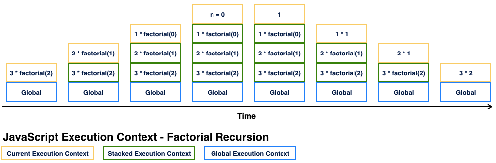
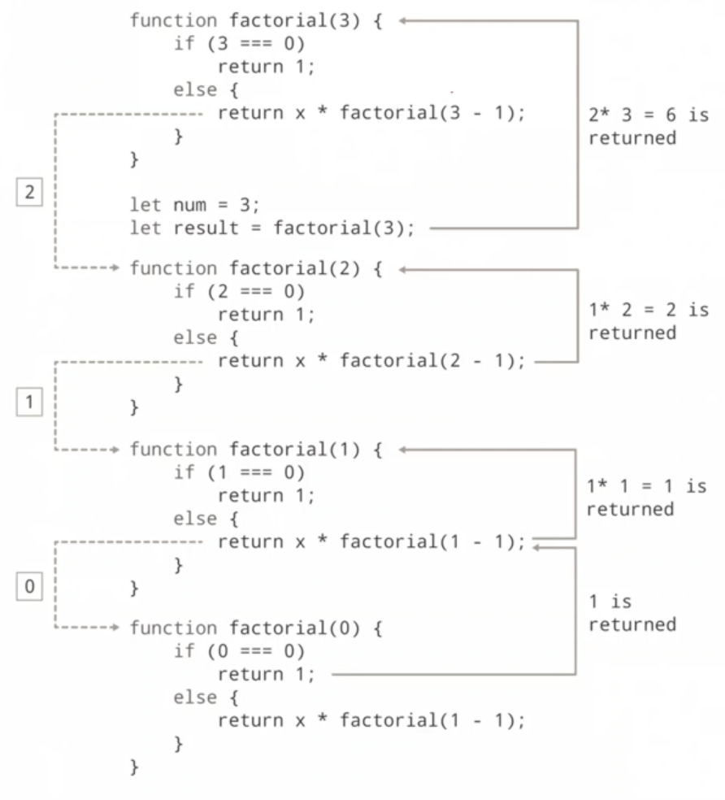

> 💡 재귀 함수의 원리를 예제를 통해 공부해보자

# 개요 🛫

---

재귀 함수는 특정 알고리즘 혹은 기능을 구현할 때 여러 장점을 얻을 수 있을 것으로 생각되어 학습을 해두는게 좋을 것 같다.

> _적재적소에 효율적으로 사용 가능한 기법이다.._

# 학습 내용 📖

---

## 재귀 함수란

### 정의

> 함수 스스로 자신을 참조해 호출하면서 동일한 코드가 반복적, 계속적으로 수행되는 함수 호출 방법

재귀 함수는 특정 조건이 됐을때 탈출하는 exit code가 필수적으로 있어야한다.

> 종결조건(exit code)가 확실하지 않으면 CPU 크래쉬를 초래한다. (반복문은 메모리가 부족하면 멈춘다.)

### 원리

Stack(Last-In-First-Out) 자료구조에 함수를 담아 수행하는 과정


이미지 : 팩토리얼 재귀호출

---

## 재귀 함수의 장 단점

**재귀함수의 장점**

1. `가독성` : 코드 라인이 줄어들고 가독성이 좋아짐
2. `재사용성` : 함수의 목적성이 분명해지고 재사용 가능한 코드가 될 수 있음

**재귀함수의 단점**

1. `시간복잡도 계산` : 반복문에 비해 계산이 어렵다.
2. `효율성` : 중첩 반복문에 비해 메모리를 더 많이 사용하고 속도가 느릴 수 있다.(함수의 오버헤드)

---

## 예제로 보는 재귀함수

> 기본적인 재귀 함수 : num + (num - 1 + (num - 1 + (...)))

```javascript
function recursive(num) {
  if (num === 0) return 0;
  return num + recursive(num - 1);
}
console.log(recursive(3)); // 6
```

> 재귀함수로 구현한 팩토리얼 : num _ (num - 1 _ (num - 1 \* (...)))

```javascript
function factorial(num) {
  if (num === 0) return 1; // num이 0일 때 return 1로하여 모든 곱이 0이 되는 현상을 방지
  return num * factorial(num - 1);
}
console.log(factorial(4)); // 24
```

---

## 팩토리얼 재귀 함수 Line by Line



위 처럼 함수가 작동한다.
