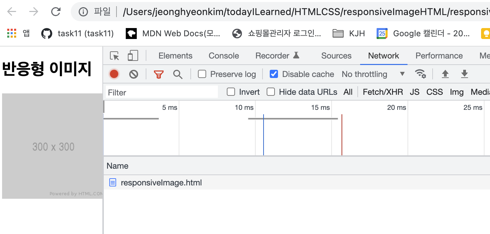
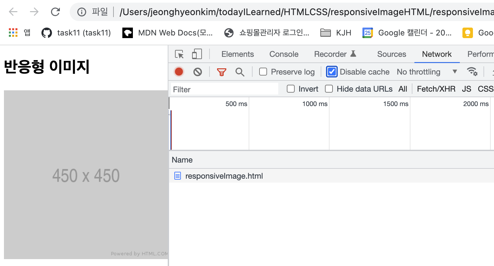
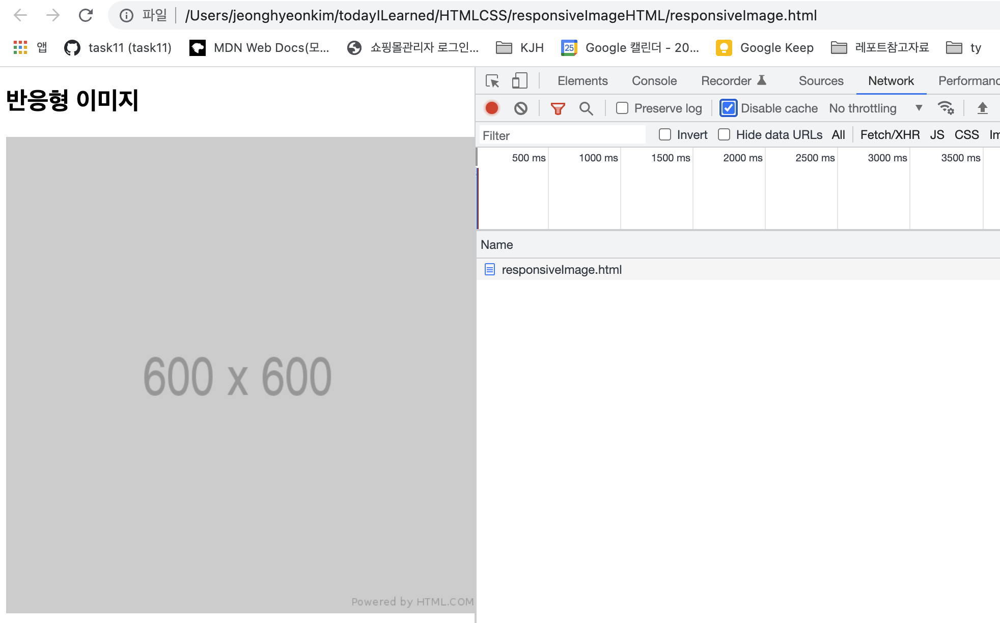
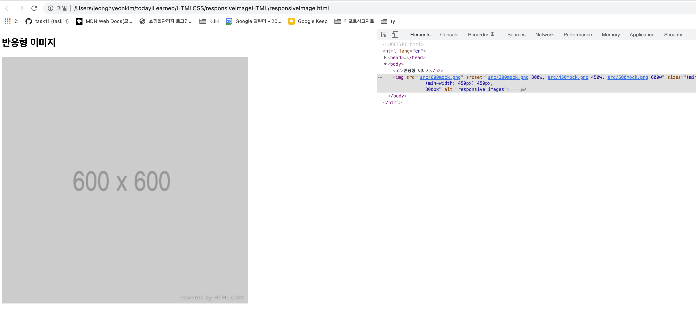

> 💡 반응형 이미지 태그에 대해 알아보자.

# 개요 🛫

---

> 이번 포스트에서는 HTML로 반응형 이미지 처리를 어떻게 하는지에 대해 알아보겠다.

HTML에서 제공하는 반응형 이미지 처리 방식은 CSS로 처리하는 반응형 웹 디자인의 일부분으로 개념을 학습해두겠다.

# 학습 내용 📖

---

## 반응형 이미지란

### 사용하는 이유

사용자의 `viewport` 즉 지금 화면을 보고있는 기기의 화면 넓이가 다를텐데, 모두 동일한 사이즈의 이미지가 보여진다면, 아래의 두 가지 문제가 발생한다.

ex) 랩탑,데스크탑 용 고해상도 이미지를 모바일에서 볼 때

1. 잘린 이미지가 보여진다.
2. 모바일 사용자가 기기에 맞는 작은 사이즈의 이미지 대신 커다란 이미지를 다운받는 것의 대역폭 낭비가 있다.

이에 대한 해결책 중 하나로 HTML 반응형 이미지 기법을 사용할 수 있다.

### 어떻게 사용할까

> `srcset` 과 `sizes`라는 두 가지 새로운 속성을 사용해 브라우저가 올바른 선택을 할 수 있게 만든다.

`srcset` 속성에는 브라우저에게 보여줄 다양한 크기의 이미지 목록과 그 크기를 정의해준다.
속성은 아래와 같은 문자열로 구성된다.

1. 이미지의 URL
2. 너비 서술자(w), 픽셀 밀도 서술자(x) `한개만 유효`

> `srcset`은 viewport에 따라 다른 이미지를 준다.

`sizes` 속성에는 미디어 조건문을 정의하고 이 조건문이 참일 때 어떤 이미지 크기가 최적인지 보여준다.

1. 미디어 조건문
2. 조건문이 참인 경우 보여줄 이미지 너비

> `sizes` 속성을 넣으면 특정 크기 이상 너비를 가진 viewport의 사용자들에게 일정한 크기의 이미지를 보여줄 수 있다.

---

## 예제로 보는 반응형 이미지 처리

> HTML 반응형 이미지 기법

### srcset

캐시를 disabled로 변경하고 테스트해야한다.

```HTML
<!DOCTYPE html>
<html lang="en">

<head>
  <meta charset="UTF-8">
  <meta http-equiv="X-UA-Compatible" content="IE=edge">
  <meta name="viewport" content="width=device-width, initial-scale=1.0">
  <title>Document</title>
</head>

<body>
  <h2>반응형 이미지</h2>

  
</body>

</html>
```

> 300w로 화면 너비를 조정할 때 나오는 이미지



> 450w로 화면 너비를 조정할 때 나오는 이미지



> 600w로 화면 너비를 조정할 때 나오는 이미지



> 브라우저가 크기에 따른 이미지를 골라서 뿌려준다. + 600w가 최대 크기인데, 화면을 늘릴수록 이미지 크기는 무제한으로 늘어난다. 이것을 해결하기 위해 `sizes`를 사용해줘야한다.

### sizes

> 미디어 조건문은 먼저 작성한 순서대로 적용된다.

아래 미디어 조건문은 이와 같다.

1. if (min-width: 600px 이상) 이미지 600px 고정
2. else if (min-width: 450px 이상) 이미지 450px 고정
3. else 이미지 300px 고정

```HTML
<!DOCTYPE html>
<html lang="en">

<head>
  <meta charset="UTF-8">
  <meta http-equiv="X-UA-Compatible" content="IE=edge">
  <meta name="viewport" content="width=device-width, initial-scale=1.0">
  <title>Document</title>
</head>

<body>
  <h2>반응형 이미지</h2>

  
</body>

</html>
```

> 600px이상으로 화면을 늘려도 이미지는 늘어나지 않는다.



> 브라우저가 미디어 조건문에 맞는 이미지를 뿌려준다.

---

# Review 💡

이번 포스트에는 반응형 이미지를 HTML 기법으로 구현해 보았다.

반응형 웹 디자인을 처리할 때 사용할 수 있겠다.
