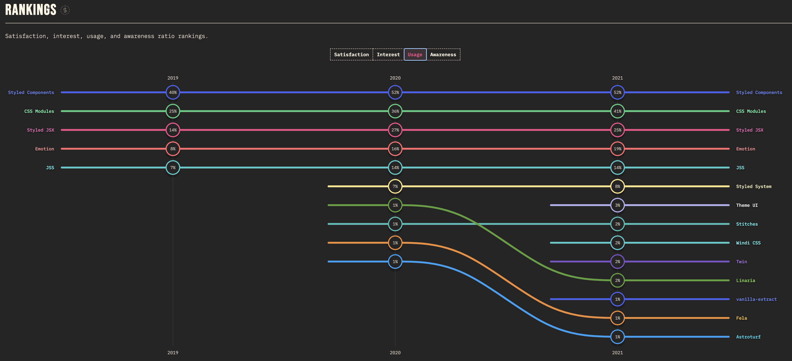
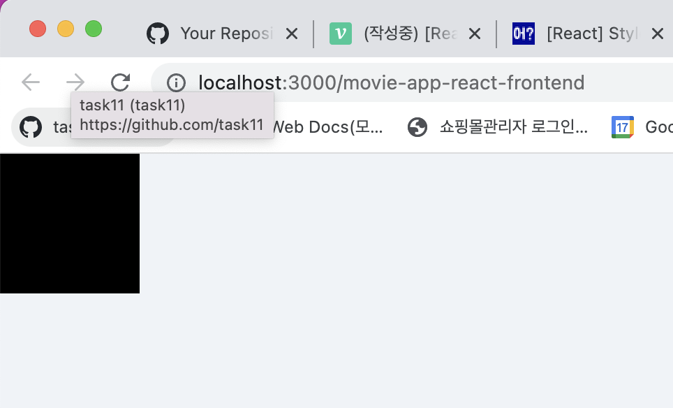
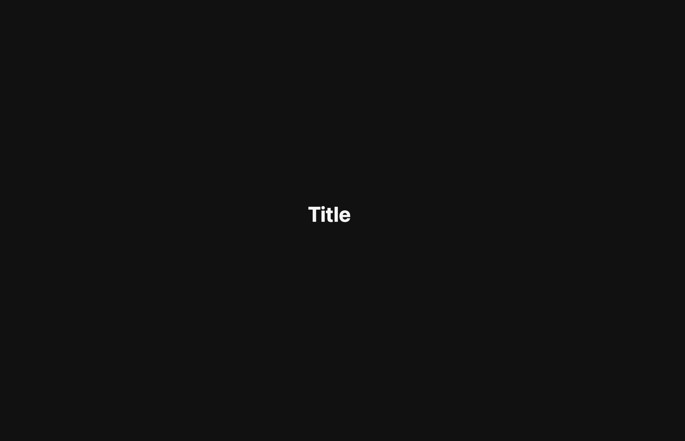

> 💡 이 포스팅은 styled-components에 대해 공부하며 정리한 내용입니다. 혹여나 일부 올바르지 않은 정보가 있을 시에 지적해주시면 정정토록하겠습니다.

# 개요 🛫

> styled-components 사용법 정리와 프로젝트 코드 리팩토링을 통한 실습을 목표로 합니다.

React에서는 보통 CSS-in-JS을 통해 스타일 작업을 진행한다.

대표적으로 사용되는 CSS-in-JS 라이브러리는 `emotion`과 `styled-components`가 있다.

이번 포스팅에서는 `styled-components`의 특징과 장/단점 그리고 사용 방법에 대해 다뤄보고자 한다.

---

# styled-components

## CSS-in-JS

stlyed-components는 CSS-in-JS의 대표적인 라이브러리이기 때문에 이를 알기전에 CSS-in-JS에 대해 알아야한다.

위 컴포넌트 스타일 방식은 기존 CSS의 `아래` 단점을 극복하고자 개발되었다.

> CSS 문제점 (Vjeux)

- Global namespace: 모든 스타일이 global에 선언되어 중복되지 않는 class 이름을 적용해야 하는 문제
- Dependencies: css 간의 의존관계를 관리하기 힘든 문제
- Dead Code Elimination: 기능 추가, 변경, 삭제 과정에서 불필요한 CSS를 제거하기 어려운 문제
- Minification: 클래스 이름의 최소화 문제
- Sharing Constants: JS 코드와 상태 값을 공유할 수 없는 문제
- Non-deterministic Resolution: CSS 로드 순서에 따라 스타일 우선 순위가 달라지는 문제
- Isolation: CSS와 JS가 분리된 탓에 상속에 따른 격리가 어려운 문제

간단하게 설명하자면 기존 CSS 스타일링 방식은 프로젝트가 커질수록 모든 html 요소에 클래스 네이밍을 명시해야하고,

컴포넌트 스타일을 변경할 때 클래스에 맞는 CSS Selector을 일일히 찾아 변경해야하기 때문에 번거로울 수 밖에 없다.

> 그래서 기존에 CSS 파일을 생성, 관리하는 과정을 CSS-in-JS의 라이브러리를 사용하여 컴포넌트 단위로 개발된 JS파일에 CSS 스타일링을 하게 된다.

하지만, 무조건 CSS-in-JS가 좋은 것 만은 아니다.

- runtime overhead가 일어날 수 있다. 사용자와의 interaction에서 애니메이션 등과 같은 연산이 필요한 페이지의 경우 (런타임에서 동적으로 스타일을 생성하기 때문에) 성능 이슈가 발생할 수 있다.
  `조금 더 깊이 이해하기 위해서는 CSS-in-JS의 동작방식인 runtime, zero-runtime 등을 찾아보길 바란다.`

- 기존 CSS-in-CSS 방식은 첫 페이지가 로드될 때 적용 가능한 모든 스타일들을 만들어두기 때문에 컴포넌트의 상태가 변경된다 하더라도 바로바로 적용이 가능하다.
  하지만 CSS-in-JS의 경우, 상태가 변경되면 우선 JS의 CSS 코드를 읽어와서 파싱하는 단계부터 시작하기 때문에 아무래도 늦어질 수 밖에 없는 문제가 있다.

- 추가적인 라이브러리 설치가 필요하기 때문에 JS의 번들 크기가 커지는 점, 이에 따라 최초 렌더링에 상대적으로 시간이 더 오래 걸린다는 것 또한 단점으로 볼 수 있다.

> 위 장/단점을 고려한뒤 스택을 채용하는 것도 중요하지만
> 개인적으로 유의미한 퍼포먼스의 차이가 나지 않는다면 개발 문화와 맞는지, `개발 친화적`인지가 가장 중요한 이슈라고 생각이 든다..

## Styled-components

> CSS-in-JS 라이브러리 중 styled-components로 디자인 시스템을 구축하기로 했다고 가정하자. emotion은 추후에 다뤄보겠다.

내가 CSS-in-JS 라이브러리들 중에서 `emotion` 등 다양한 것들을 제외하고 `styled-components`를 먼저 공부하는 이유는



아직까진 타 라이브러리 대비 사용량이 높기 때문이다. ~~(reference가 많겠죵?)~~ 추후에는 `emotion` `stylex` `stitches.js` 과 같은 라이브러리도 사용해보고자한다.

`stlyed-conponents`의 장점은 아래와 같다. ~~대부분 CSS-in-JS의 장 단점을 상속받고 있는 것을 볼 수 있다.~~

- CSS 모델을 문서 레벨이 아닌 컴포넌트 레벨로 추상화하는 모듈성
- CSS-in-JS는 JavaScript 환경을 최대한 활용
- 자바스크립트와 CSS 사이의 상수와 함수를 공유
- 현재 사용 중인 스타일만 DOM에 포함
- 짧은 길이의 유니크 한 클래스를 자동으로 생성하는 코드 경량화 `vendor prefix`

단점은 아래와 같다.

- CSS 대비 높은 러닝 커브(Learning Curve)
- 새로운 의존성 발생
- 별도의 라이브러리 설치에 따른 번들 크기 증대 및 CSS-in-CSS에 비해 느린 속도

> 장 단점을 정리하면서 한번 더 `개발 친화적`인 점이 중요하다는 생각이 든다.

---

# How to use 📖

> 설치부터 예제까지 작성해보자.

## 1. Install

아래 명령어를 작성해 새로운 CRA 앱을 생성하고, styled-components를 설치해준다.

```bash
$ npx create-react-app project-name
$ npm i styled-components
```

## 2. Basic Example

`App.js` 컴포넌트에 아래와 같이 작성한다.

```jsx
import React from "react";
import styled from "styled-components";

const Wrapper = styled.div`
  display: flex;
  height: 100px;
  width: 100px;
  justify-content: center;
  align-items: center;
  background-color: black;
`;

function App() {
  return <Wrapper></Wrapper>;
}

export default App;
```

> styled-components 를 사용하면 이렇게 스타일을 입력함과 동시에 해당 스타일을 가진 컴포넌트를 만들 수 있다.
> 위 예제처럼 div 를 스타일링 하고 싶으면 styled.div + 백틱을 사용하면 되고, span이나 button 을 스타일링 하고 싶으면 styled.tag-name 으로 사용하면 된다.



## 3. Theme

일관적인 스타일 관리를 위해 자주 사용하게 될 색상 코드, 사이즈 등의 정보를 생성해 상위 컴포넌트에 정의할 수 있다.

styled-component에서 이런 변수 객체를 `theme`이라고 부른다.

상위 컴포넌트 `index.js`

```jsx
import React from "react";
import { ThemeProvider } from "styled-components";
import App from "./App";

const darkTheme = {
  textColor: "whitesmoke",
  backgroundColor: "#111",
};

const lightTheme = {
  textColor: "#111",
  backgroundColor: "whitesmoke",
};

ReactDOM.render(
  <React.StrictMode>
    <ThemeProvider theme={darkTheme}>
      <App />
    </ThemeProvider>
  </React.StrictMode>,
  document.getElementById("root")
);
```

최상위 컨테이너에서 `ThemeProvider` 태그에 theme 객체를 보내준다.

하위 컴포넌트 `App.js`

```jsx
import React from "react";
import styled from "styled-components";

const Title = styled.h1`
  color: ${(props) => props.theme.textColor};
`;

const Wrapper = styled.div`
  display: flex;
  height: 100vh;
  width: 100vw;
  justify-content: center;
  align-items: center;
  background-color: ${(props) => props.theme.backgroundColor};
`;

function App() {
  return (
    <Wrapper>
      <Title>Title</Title>
    </Wrapper>
  );
}

export default App;
```

theme 객체는 템플릿 리터럴 내부에 `props.theme.value` 로 값에 접근할 수 있다.

**바로 하위 컴포넌트** 외에도 모든 컴포넌트에서 theme 객체에 접근할 수 있다.



---

# Refactor Example

> CSS module로 작성된 리액트 프로젝트를 styled-components로 리팩토링해봅니다.

[github link: movie-app-react-frontend](https://github.com/task11/movie-app-react-frontend)

---

# References 🙏🏽

- [styled-components docs](https://styled-components.com/)
- [Nwose Lotanna-Benefits of using styled-components in React
  ](https://blog.logrocket.com/benefits-using-styled-components-react/)
